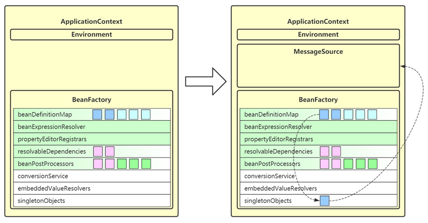
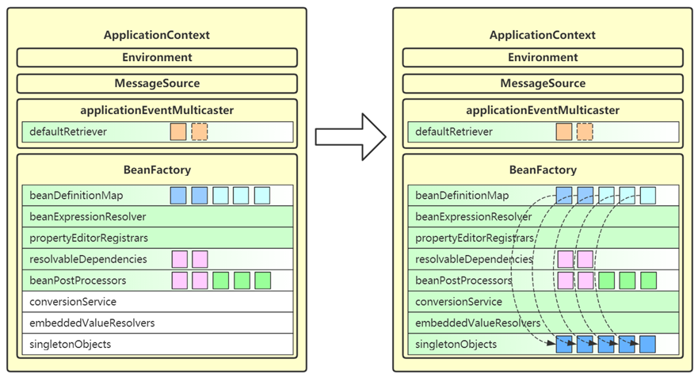
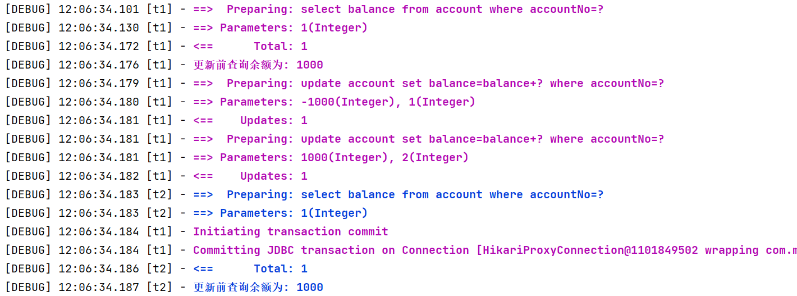
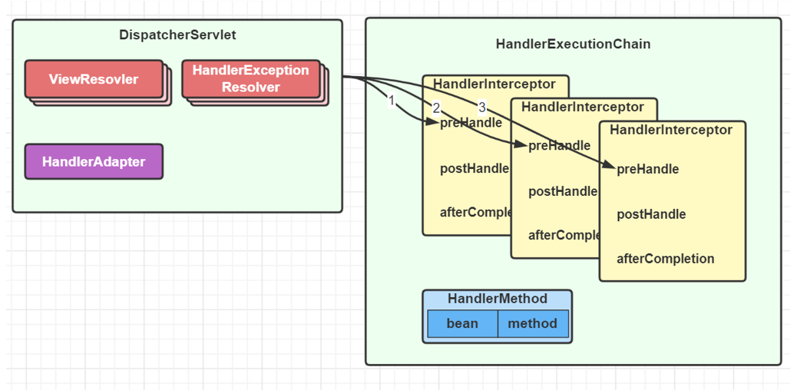

# 框架篇

## 1. Spring refresh 流程

**要求**

* 掌握 refresh 的 12 个步骤

**Spring refresh 概述**

refresh 是 AbstractApplicationContext 中的一个方法，负责初始化 ApplicationContext 容器，容器必须调用 refresh 才能正常工作。它的内部主要会调用 12 个方法，我们把它们称为 refresh 的 12 个步骤：

1. prepareRefresh

2. obtainFreshBeanFactory

3. prepareBeanFactory

4. postProcessBeanFactory

5. invokeBeanFactoryPostProcessors

6. registerBeanPostProcessors

7. initMessageSource

8. initApplicationEventMulticaster

9. onRefresh

10. registerListeners

11. finishBeanFactoryInitialization

12. finishRefresh

> ***功能分类***
>
> * 1 为准备环境
>
> * 2 3 4 5 6 为准备 BeanFactory
>
> * 7 8 9 10 12 为准备 ApplicationContext
>
> * 11 为初始化 BeanFactory 中非延迟单例 bean


**1. prepareRefresh**

* 这一步创建和准备了 Environment 对象，它作为 ApplicationContext 的一个成员变量

* Environment 对象的作用之一是为后续 @Value，值注入时提供键值
* Environment 分成三个主要部分
  * systemProperties - 保存 java 环境键值（编码、分隔符）
  * systemEnvironment - 保存系统环境键值（JAVA_HOME\PATH\CLASSPATH）
  * 自定义 PropertySource - 保存自定义键值，例如来自于 *.properties 文件的键值（application.properties）


```java
import org.springframework.beans.factory.annotation.QualifierAnnotationAutowireCandidateResolver;
import org.springframework.beans.factory.annotation.Value;
import org.springframework.beans.factory.config.BeanExpressionContext;
import org.springframework.beans.factory.config.DependencyDescriptor;
import org.springframework.beans.factory.support.DefaultListableBeanFactory;
import org.springframework.context.expression.StandardBeanExpressionResolver;
import org.springframework.core.env.Environment;
import org.springframework.core.env.StandardEnvironment;
import org.springframework.core.io.ClassPathResource;
import org.springframework.core.io.support.ResourcePropertySource;

import java.io.IOException;

// 如何获得和解析 @Value 内容
public class TestEnvironment {
    public static void main(String[] args) throws NoSuchFieldException, IOException {
        // 1) 获得 @Value 的值
        System.out.println("=======================> 仅获取 @Value 值");
        // 限定符注解自动装配候选解析器
        QualifierAnnotationAutowireCandidateResolver resolver = new QualifierAnnotationAutowireCandidateResolver();
        //                      获取建议值             依赖描述符                      获取声明字段
        Object name = resolver.getSuggestedValue(new DependencyDescriptor(Bean1.class.getDeclaredField("name"), false));
        System.out.println(name);

        // 2) 解析 @Value 的值
        System.out.println("=======================> 获取 @Value 值, 并解析${}");
        Object javaHome = resolver.getSuggestedValue(new DependencyDescriptor(Bean1.class.getDeclaredField("javaHome"), false));
        System.out.println(javaHome);
        //                                  解析占位符
        System.out.println(getEnvironment().resolvePlaceholders(javaHome.toString()));

        // 3) 解析 SpEL 表达式（spring el）
        System.out.println("=======================> 获取 @Value 值, 并解析#{}");
        Object expression = resolver.getSuggestedValue(new DependencyDescriptor(Bean1.class.getDeclaredField("expression"), false));
        System.out.println(expression);
        String resolvePlaceholders = getEnvironment().resolvePlaceholders(expression.toString());
        System.out.println(resolvePlaceholders);
        //                    标准bean表达式解析器                                                  Bean 表达式上下文            默认可列出的 Bean 工厂
        Object evaluate = new StandardBeanExpressionResolver().evaluate(resolvePlaceholders, new BeanExpressionContext(new DefaultListableBeanFactory(), null));
        System.out.println(evaluate);
    }

    private static Environment getEnvironment() throws IOException {
        StandardEnvironment env = new StandardEnvironment();
        //  获取属性来源            添加最后一个   资源属性来源
        env.getPropertySources().addLast(new ResourcePropertySource("jdbc", new ClassPathResource("jdbc.properties")));
        return env;
    }

    static class Bean1 {
        @Value("hello")
        private String name;


//        @Value("${JAVA_HOME}")
//        @Value("${Path}") // 系统变量+用户变量
        @Value("${jdbc.username}")
//        @Value("class version:${java.class.version}")
        private String javaHome;

        @Value("#{'class version:' + '${java.class.version}'}")
        private String expression;
    }
}
```

**2. obtainFreshBeanFactory**

* 这一步获取（或创建） BeanFactory，它也是作为 ApplicationContext 的一个成员变量
* BeanFactory 的作用是负责 bean 的创建、依赖注入和初始化，bean 的各项特征由 BeanDefinition 定义
  * BeanDefinition 作为 bean 的设计蓝图，规定了 bean 的特征，如单例多例、依赖关系、初始销毁方法等
  * BeanDefinition 的来源有多种多样，可以是通过 xml 获得、配置类获得、组件扫描获得，也可以是编程添加
* 所有的 BeanDefinition 会存入 BeanFactory 中的 beanDefinitionMap 集合


```java
import org.springframework.beans.factory.support.BeanDefinitionBuilder;
import org.springframework.beans.factory.support.DefaultListableBeanFactory;
import org.springframework.beans.factory.xml.XmlBeanDefinitionReader;
import org.springframework.context.annotation.Bean;
import org.springframework.context.annotation.ClassPathBeanDefinitionScanner;
import org.springframework.context.annotation.ConfigurationClassPostProcessor;
import org.springframework.core.io.ClassPathResource;

import java.util.Arrays;

// 演示各种 BeanDefinition 的来源
public class TestBeanDefinition {
    public static void main(String[] args) {
        System.out.println("========================> 一开始");
        DefaultListableBeanFactory beanFactory = new DefaultListableBeanFactory();
        System.out.println(Arrays.toString(beanFactory.getBeanDefinitionNames()));

        System.out.println("========================> 1) 从 xml 获取 ");
        // Xml Bean 定义读取器
        XmlBeanDefinitionReader xmlBeanDefinitionReader = new XmlBeanDefinitionReader(beanFactory);
        //      加载 Bean 定义            类路径资源
        xmlBeanDefinitionReader.loadBeanDefinitions(new ClassPathResource("bd.xml"));
        System.out.println(Arrays.toString(beanFactory.getBeanDefinitionNames()));

        System.out.println("========================> 2) 从配置类获取 ");
        //          注册 Bean 定义                      Bean 定义生成器        通用 Bean 定义                         获取 Bean 定义
        beanFactory.registerBeanDefinition("config1", BeanDefinitionBuilder.genericBeanDefinition(Config1.class).getBeanDefinition());

        // 配置类后处理器
        ConfigurationClassPostProcessor postProcessor = new ConfigurationClassPostProcessor();
        //            后处理 Bean 定义注册表（bean2）
        postProcessor.postProcessBeanDefinitionRegistry(beanFactory);
        System.out.println(Arrays.toString(beanFactory.getBeanDefinitionNames()));

        System.out.println("========================> 3) 扫描获取 ");
        // 类路径 Bean 定义扫描器
        ClassPathBeanDefinitionScanner scanner = new ClassPathBeanDefinitionScanner(beanFactory);
        scanner.scan("day04.refresh.sub");
        System.out.println(Arrays.toString(beanFactory.getBeanDefinitionNames()));
    }

    static class Bean1 {

    }

    static class Bean2 {

    }

    static class Config1 {
        @Bean
        public Bean2 bean2() {
            return new Bean2();
        }
    }
}

```
```java
package day04.refresh.sub;
import org.springframework.stereotype.Component;
@Component
public class Bean3 {
}
```

**3. prepareBeanFactory**

* 这一步会进一步完善 BeanFactory，为它的各项成员变量赋值
* beanExpressionResolver 用来解析 SpEL，常见实现为 StandardBeanExpressionResolver
* propertyEditorRegistrars 会注册类型转换器 （转换String类型）
  * 它在这里使用了 ResourceEditorRegistrar 实现类
  * 并应用 ApplicationContext 提供的 Environment 完成 ${ } 解析
* registerResolvableDependency 来注册 beanFactory 以及 ApplicationContext，让它们也能用于依赖注入
* beanPostProcessors 是 bean 后处理器集合，会工作在 bean 的生命周期各个阶段，此处会添加两个：
  * ApplicationContextAwareProcessor 用来解析 Aware 接口
  * ApplicationListenerDetector 用来识别容器中 ApplicationListener 类型的 bean


**4. postProcessBeanFactory**

* 这一步是空实现，留给子类扩展。
  * 一般 Web 环境的 ApplicationContext 都要利用它注册新的 Scope（除了单例和原型还有request,response），完善 Web 下的 BeanFactory
* 这里体现的是模板方法设计模式

**5. invokeBeanFactoryPostProcessors**

* 这一步会调用 beanFactory 后处理器
* beanFactory 后处理器，充当 beanFactory 的扩展点，可以用来补充或修改 BeanDefinition
* 常见的 beanFactory 后处理器有
  * ConfigurationClassPostProcessor – 解析 @Configuration、@Bean、@Import、@PropertySource 等
  * PropertySourcesPlaceHolderConfigurer – 替换 BeanDefinition 中的 ${ } （过去xml常使用）
  * MapperScannerConfigurer – 补充 Mapper 接口对应的 BeanDefinition


**6. registerBeanPostProcessors**

* 这一步是继续从 beanFactory 中找出 bean 后处理器，添加至 beanPostProcessors 集合中
* bean 后处理器，充当 bean 的扩展点，可以工作在 bean 的实例化、依赖注入、初始化阶段，常见的有：
  * AutowiredAnnotationBeanPostProcessor 功能有：解析 @Autowired，@Value 注解
  * CommonAnnotationBeanPostProcessor 功能有：解析 @Resource，@PostConstruct，@PreDestroy
  * AnnotationAwareAspectJAutoProxyCreator 功能有：为符合切点的目标 bean 自动创建代理

```java
package day04.refresh;

import org.aspectj.lang.annotation.Aspect;
import org.aspectj.lang.annotation.Before;
import org.springframework.aop.aspectj.annotation.AnnotationAwareAspectJAutoProxyCreator;
import org.springframework.beans.factory.annotation.Autowired;
import org.springframework.beans.factory.annotation.AutowiredAnnotationBeanPostProcessor;
import org.springframework.beans.factory.support.BeanDefinitionBuilder;
import org.springframework.beans.factory.support.DefaultListableBeanFactory;
import org.springframework.context.annotation.CommonAnnotationBeanPostProcessor;
import org.springframework.context.support.GenericApplicationContext;

import javax.annotation.Resource;

public class TestBeanPostProcessor {

    public static void main(String[] args) {
        GenericApplicationContext context = new GenericApplicationContext();
        DefaultListableBeanFactory beanFactory = context.getDefaultListableBeanFactory();
        beanFactory.registerBeanDefinition("bean1", BeanDefinitionBuilder.genericBeanDefinition(Bean1.class).getBeanDefinition());
        beanFactory.registerBeanDefinition("bean2", BeanDefinitionBuilder.genericBeanDefinition(Bean2.class).getBeanDefinition());
        beanFactory.registerBeanDefinition("bean3", BeanDefinitionBuilder.genericBeanDefinition(Bean3.class).getBeanDefinition());
        beanFactory.registerBeanDefinition("aspect1", BeanDefinitionBuilder.genericBeanDefinition(Aspect1.class).getBeanDefinition());
        beanFactory.registerBeanDefinition("processor1",
                BeanDefinitionBuilder.genericBeanDefinition(AutowiredAnnotationBeanPostProcessor.class).getBeanDefinition());
        beanFactory.registerBeanDefinition("processor2",
                BeanDefinitionBuilder.genericBeanDefinition(CommonAnnotationBeanPostProcessor.class).getBeanDefinition());
        beanFactory.registerBeanDefinition("processor3",
                BeanDefinitionBuilder.genericBeanDefinition(AnnotationAwareAspectJAutoProxyCreator.class).getBeanDefinition());

        context.refresh();
        beanFactory.getBean(Bean1.class).foo();
    }
    static class Bean1 {
        Bean2 bean2;
        Bean3 bean3;
        @Autowired
        public void setBean2(Bean2 bean2) {
            System.out.println("发生了依赖注入..." + bean2);
            this.bean2 = bean2;
        }
        @Resource
        public void setBean3(Bean3 bean3) {
            System.out.println("发生了依赖注入..." + bean3);
            this.bean3 = bean3;
        }
        public void foo() {
            System.out.println("foo");
        }
    }
    static class Bean2 {
    }
    static class Bean3 {
    }
    @Aspect
    static class Aspect1 {
        @Before("execution(* foo())")
        public void before() {
            System.out.println("before...");
        }
    }
}
```


**7. initMessageSource**

* 这一步是为 ApplicationContext 添加 messageSource 成员，实现国际化功能
* 去 beanFactory 内找名为 messageSource 的 bean，如果没有，则提供空的 MessageSource 实现



**8. initApplicationContextEventMulticaster**

* 这一步为 ApplicationContext 添加事件广播器成员，即 applicationContextEventMulticaster
* 它的作用是发布事件给监听器
* 去 beanFactory 找名为 applicationEventMulticaster 的 bean 作为事件广播器，若没有，会创建默认的事件广播器
* 之后就可以调用 ApplicationContext.publishEvent(事件对象) 来发布事件


**9. onRefresh**

* 这一步是空实现，留给子类扩展
  * SpringBoot 中的子类在这里准备了 WebServer，即内嵌 web 容器
* 体现的是模板方法设计模式

**10. registerListeners**

* 这一步会从多种途径找到事件监听器，并添加至 applicationEventMulticaster
* 事件监听器顾名思义，用来接收事件广播器发布的事件，有如下来源
  * 事先编程添加的
  * 来自容器中的 bean
  * 来自于 @EventListener 的解析
* 要实现事件监听器，只需要实现 ApplicationListener 接口，重写其中 onApplicationEvent(E e) 方法即可


**11. finishBeanFactoryInitialization**

* 这一步会将 beanFactory 的成员补充完毕，并初始化所有非延迟单例 bean
* conversionService 也是一套转换机制，作为对 PropertyEditor 的补充
* embeddedValueResolvers 即内嵌值解析器，用来解析 @Value 中的 ${ }，借用的是 Environment 的功能
* singletonObjects 即单例池，缓存所有单例对象
  * 对象的创建都分三个阶段，每一阶段都有不同的 bean 后处理器参与进来，扩展功能



**12. finishRefresh**

* 这一步会为 ApplicationContext 添加 lifecycleProcessor 成员，用来控制容器内需要生命周期管理的 bean
* 如果容器中有名称为 lifecycleProcessor 的 bean 就用它，否则创建默认的生命周期管理器
* 准备好生命周期管理器，就可以实现
  * 调用 context 的 start，即可触发所有实现 LifeCycle 接口 bean 的 start
  * 调用 context 的 stop，即可触发所有实现 LifeCycle 接口 bean 的 stop
* 发布 ContextRefreshed 事件，整个 refresh 执行完成


## 2. Spring bean 生命周期

**要求**

* 掌握 Spring bean 的生命周期

**bean 生命周期 概述**

bean 的生命周期从调用 beanFactory 的 getBean 开始，到这个 bean 被销毁，可以总结为以下七个阶段：

1. 处理名称，检查缓存
2. 处理父子容器
3. 处理 dependsOn
4. 选择 scope 策略
5. 创建 bean
6. 类型转换处理
7. 销毁 bean

> ***注意***
>
> * 划分的阶段和名称并不重要，重要的是理解整个过程中做了哪些事情


**1. 处理名称，检查缓存**

* 这一步会处理别名，将别名解析为实际名称
* 对 FactoryBean 也会特殊处理，如果以 & 开头表示要获取 FactoryBean 本身，否则表示要获取其产品
* 这里针对单例对象会检查一级、二级、三级缓存
  * singletonFactories 三级缓存，存放单例工厂对象
  * earlySingletonObjects 二级缓存，存放单例工厂的产品对象
    * 如果发生循环依赖，产品是代理；无循环依赖，产品是原始对象
  * singletonObjects 一级缓存，存放单例成品对象

**2. 处理父子容器**

* 如果当前容器根据名字找不到这个 bean，此时若父容器存在，则执行父容器的 getBean 流程
* 父子容器的 bean 名称可以重复

**3. 处理 dependsOn**

* 如果当前 bean 有通过 dependsOn 指定了非显式依赖的 bean，这一步会提前创建这些 dependsOn 的 bean 
* 所谓非显式依赖，就是指两个 bean 之间不存在直接依赖关系，但需要控制它们的创建先后顺序

**4. 选择 scope 策略**

* 对于 singleton scope，首先到单例池去获取 bean，如果有则直接返回，没有再进入创建流程
* 对于 prototype scope，每次都会进入创建流程
* 对于自定义 scope，例如 request，首先到 request 域获取 bean，如果有则直接返回，没有再进入创建流程


```java
package day04.bean;

import day02.LoggerUtils;
import org.springframework.context.annotation.CommonAnnotationBeanPostProcessor;
import org.springframework.context.support.GenericApplicationContext;
import org.springframework.mock.web.MockHttpServletRequest;
import org.springframework.web.context.request.RequestContextHolder;
import org.springframework.web.context.request.RequestScope;
import org.springframework.web.context.request.ServletWebRequest;

import javax.annotation.PostConstruct;
import javax.annotation.PreDestroy;

public class TestScope {
    public static void main(String[] args) {
        testRequestScope();
    }

    // 单例 bean 从 refresh 被创建, 到 close 被销毁, BeanFactory 会记录哪些 bean 要调用销毁方法
    private static void testSingletonScope() {
        GenericApplicationContext context = new GenericApplicationContext();
        context.registerBean("bean1", Bean1.class);
        context.registerBean(CommonAnnotationBeanPostProcessor.class);
        context.refresh(); // getBean
        context.close();
    }

    // 多例 bean 从首次 getBean 被创建, 到调用 BeanFactory 的 destroyBean 被销毁
    private static void testPrototypeScope() {
        GenericApplicationContext context = new GenericApplicationContext();
        context.registerBean("bean1", Bean1.class, bd -> bd.setScope("prototype"));
        context.registerBean(CommonAnnotationBeanPostProcessor.class);
        context.refresh();

        Bean1 bean = context.getBean(Bean1.class);
        // 没谁记录该 bean 要调用销毁方法, 需要我们自行调用
        context.getDefaultListableBeanFactory().destroyBean(bean);

        context.close();
    }

    // request bean 从首次 getBean 被创建, 到 request 结束前被销毁
    private static void testRequestScope() {
        GenericApplicationContext context = new GenericApplicationContext();
        context.getDefaultListableBeanFactory().registerScope("request", new RequestScope());
        context.registerBean("bean1", Bean1.class, bd -> bd.setScope("request"));
        context.registerBean(CommonAnnotationBeanPostProcessor.class);
        context.refresh();

        for (int i = 0; i < 2; i++) {
            new Thread(() -> {
                MockHttpServletRequest request = new MockHttpServletRequest();
                // 每个 webRequest 对象会记录哪些 bean 要调用销毁方法
                ServletWebRequest webRequest = new ServletWebRequest(request);
                RequestContextHolder.setRequestAttributes(webRequest);

                Bean1 bean = context.getBean(Bean1.class);
                LoggerUtils.get().debug("{}", bean);
                LoggerUtils.get().debug("{}", request.getAttribute("bean1"));

                // request 请求结束前调用这些销毁方法
                webRequest.requestCompleted();
            }).start();
        }

    }

    static class Bean1 {
        @PostConstruct
        public void init() {
            LoggerUtils.get().debug("{} - init", this);
        }

        @PreDestroy
        public void destroy() {
            LoggerUtils.get().debug("{} - destroy", this);
        }
    }
}
```

**5.1 创建 bean - 创建 bean 实例（重点）**

| **要点**                                                     | **总结**                                                     |
| ------------------------------------------------------------ | ------------------------------------------------------------ |
| 有自定义 TargetSource 的情况                                 | 由 AnnotationAwareAspectJAutoProxyCreator 创建代理返回       |
| Supplier 方式创建 bean 实例                                  | 为 Spring 5.0 新增功能，方便编程方式创建  bean  实例         |
| FactoryMethod 方式  创建 bean  实例                          | ① 分成静态工厂与实例工厂；② 工厂方法若有参数，需要对工厂方法参数进行解析，利用  resolveDependency；③ 如果有多个工厂方法候选者，还要进一步按权重筛选 |
| <span style="color: red;">**AutowiredAnnotationBeanPostProcessor**</span> | ① 优先选择带  @Autowired  注解的构造；② 若有唯一的带参构造，也会入选 |
| mbd.getPreferredConstructors                                 | 选择所有公共构造，这些构造之间按权重筛选                     |
| <span style="color: red;">**采用默认构造**</span>            | 如果上面的后处理器和 BeanDefiniation 都没找到构造，采用默认构造，即使是私有的 |

**5.2 创建 bean - 依赖注入**

| **要点**                                                     | **总结**                                                     |
| ------------------------------------------------------------ | ------------------------------------------------------------ |
| <span style="color: red;">**采用默认构造AutowiredAnnotationBeanPostProcessor**</span> | 识别   @Autowired  及 @Value  标注的成员，封装为  InjectionMetadata 进行依赖注入 |
| <span style="color: red;">**CommonAnnotationBeanPostProcessor**</span> | 识别   @Resource  标注的成员，封装为  InjectionMetadata 进行依赖注入 |
| resolveDependency                                            | 用来查找要装配的值，可以识别：① Optional；② ObjectFactory 及 ObjectProvider；③ @Lazy  注解；④ @Value  注解（${  }, #{ }, 类型转换）；⑤ 集合类型（Collection，Map，数组等）；⑥ 泛型和  @Qualifier（用来区分类型歧义）；⑦ primary  及名字匹配（用来区分类型歧义） |
| <span style="color: red;">**AUTOWIRE_BY_NAME**</span>        | 根据成员名字找 bean 对象，修改 mbd 的 propertyValues，不会考虑简单类型的成员 |
| <span style="color: red;">**AUTOWIRE_BY_TYPE**</span>        | 根据成员类型执行 resolveDependency 找到依赖注入的值，修改  mbd 的 propertyValues |
| <span style="color: red;">**applyPropertyValues**</span>     | 根据 mbd 的 propertyValues 进行依赖注入（即xml中 `<property name ref                                                                                                                                 |value/>`） |

```java
package day04.bean;

import org.springframework.beans.factory.annotation.Autowired;
import org.springframework.beans.factory.annotation.Qualifier;
import org.springframework.beans.factory.config.RuntimeBeanReference;
import org.springframework.beans.factory.support.AbstractBeanDefinition;
import org.springframework.beans.factory.support.RootBeanDefinition;
import org.springframework.context.annotation.AnnotationConfigUtils;
import org.springframework.context.support.GenericApplicationContext;

// 测试如果对同一属性进行的 @Autowired 注入、AUTOWIRE_BY_NAME、精确指定注入名称, 优先级是怎样的
// ref > byName > Autowired
public class TestInjection {
    public static void main(String[] args) {
        GenericApplicationContext context = new GenericApplicationContext();
        AnnotationConfigUtils.registerAnnotationConfigProcessors(context.getDefaultListableBeanFactory());
        context.registerBean("bean1", Bean1.class, bd -> {
            // 优先级最高的：精确指定注入 bean 的名称 <property name="bean3" ref="bean2"/>
            bd.getPropertyValues().add("bean3", new RuntimeBeanReference("bean2"));
            // 优先级次之的：通过 AUTOWIRE_BY_NAME 匹配
            ((RootBeanDefinition) bd).setAutowireMode(AbstractBeanDefinition.AUTOWIRE_BY_NAME);
        });
        context.registerBean("bean2", Bean2.class);
        context.registerBean("bean3", Bean3.class);
        context.registerBean("bean4", Bean4.class);

        context.refresh();
    }

    static class Bean1 {
        MyInterface bean;

        // 优先级最低的：@Autowired 匹配
        @Autowired @Qualifier("bean4")
        public void setBean3(MyInterface bean) {
            System.out.println(bean);
            this.bean = bean;
        }
    }

    interface MyInterface {
    }

    static class Bean2 implements MyInterface {
    }

    static class Bean3 implements MyInterface {
    }

    static class Bean4 implements MyInterface {
    }
}
```

**5.3 创建 bean - 初始化**

| **要点**                                                   | **总结**                                                     |
| ---------------------------------------------------------- | ------------------------------------------------------------ |
| <span style="color: red;">**内置 Aware 接口的装配**</span> | 包括 BeanNameAware，BeanFactoryAware 等                      |
| <span style="color: red;">**扩展 Aware 接口的装配**</span> | 由 ApplicationContextAwareProcessor 解析，执行时机在  postProcessBeforeInitialization |
| <span style="color: red;">**@PostConstruct**</span>        | 由 CommonAnnotationBeanPostProcessor 解析，执行时机在  postProcessBeforeInitialization |
| <span style="color: red;">**InitializingBean**</span>      | 通过接口回调执行初始化                                       |
| <span style="color: red;">**initMethod**</span>            | 根据 BeanDefinition 得到的初始化方法执行初始化，即 `<bean init-method>` 或 @Bean(initMethod) |
| <span style="color: red;">**创建 aop 代理**</span>         | 由 AnnotationAwareAspectJAutoProxyCreator 创建，执行时机在  postProcessAfterInitialization |

```java
// 4 - 2 - 1 -3
package day04.bean;

import org.springframework.beans.BeansException;
import org.springframework.beans.factory.BeanFactory;
import org.springframework.beans.factory.BeanFactoryAware;
import org.springframework.beans.factory.InitializingBean;
import org.springframework.context.annotation.CommonAnnotationBeanPostProcessor;
import org.springframework.context.support.GenericApplicationContext;

import javax.annotation.PostConstruct;

public class TestInitialization {

    public static void main(String[] args) {
        GenericApplicationContext context = new GenericApplicationContext();
        context.registerBean(CommonAnnotationBeanPostProcessor.class);
        // <bean init-method="initMethod">
        context.registerBean("bean1", Bean1.class, bd -> bd.setInitMethodName("initMethod"));
        context.refresh();
    }

    static class Bean1 implements InitializingBean, BeanFactoryAware {

        @Override//InitializingBean初始化
        public void afterPropertiesSet() throws Exception {
            System.out.println(1);
        }

        @PostConstruct
        public void init() {
            System.out.println(2);
        }

        public void initMethod() {
            System.out.println(3);
        }

        @Override//BeanFactoryAware初始化
        public void setBeanFactory(BeanFactory beanFactory) throws BeansException {
            System.out.println(4);
        }
    }
}
```
**5.4 创建 bean - 注册可销毁 bean**

在这一步判断并登记可销毁 bean

* 判断依据
  * 如果实现了 DisposableBean 或 AutoCloseable 接口，则为可销毁 bean
  * 如果自定义了 destroyMethod，则为可销毁 bean
  * 如果采用 @Bean 没有指定 destroyMethod，则采用自动推断方式获取销毁方法名（close，shutdown）
  * 如果有 @PreDestroy 标注的方法
* 存储位置
  * singleton scope 的可销毁 bean 会存储于 beanFactory 的成员当中
  * 自定义 scope 的可销毁 bean 会存储于对应的域对象当中
  * prototype scope 不会存储，需要自己找到此对象销毁
* 存储时都会封装为 DisposableBeanAdapter（一次性Bean适配器）类型对销毁方法的调用进行适配

**6. 类型转换处理**

* 如果 getBean 的 requiredType 参数与实际得到的对象类型不同，会尝试进行类型转换

**7. 销毁 bean**

* 销毁时机
  * singleton bean 的销毁在 ApplicationContext.close 时，此时会找到所有 DisposableBean 的名字，逐一销毁
  * 自定义 scope bean 的销毁在作用域对象生命周期结束时
  * prototype bean 的销毁可以通过自己手动调用 AutowireCapableBeanFactory.destroyBean 方法执行销毁
* 同一 bean 中不同形式销毁方法的调用次序
  * 优先后处理器销毁，即 @PreDestroy
  * 其次 DisposableBean 接口销毁
  * 最后 destroyMethod 销毁（包括自定义名称，推断名称，AutoCloseable 接口 多选一）


## 4. Spring 事务失效

**要求**

* 掌握事务失效的八种场景

**1. 抛出检查异常导致事务不能正确回滚**

* 原因：Spring Transactional 默认只对runtime和error子类的异常进行回滚，检查异常不回滚
* 例如io异常不进行回滚，需要手动处理（建议：@Transactional(rollbackFor = Exception.class))

```java
package day04.tx.app.service;

import day04.tx.AppConfig;
import org.springframework.boot.context.properties.ConfigurationPropertiesBindingPostProcessor;
import org.springframework.context.annotation.AnnotationConfigUtils;
import org.springframework.context.support.GenericApplicationContext;

import java.io.FileNotFoundException;

public class TestService1 {
    public static void main(String[] args) throws FileNotFoundException {
        GenericApplicationContext context = new GenericApplicationContext();
        AnnotationConfigUtils.registerAnnotationConfigProcessors(context.getDefaultListableBeanFactory());
        ConfigurationPropertiesBindingPostProcessor.register(context.getDefaultListableBeanFactory());
        context.registerBean(AppConfig.class);
        context.refresh();

        Service1 bean = context.getBean(Service1.class);
        bean.transfer(1, 2, 500);
    }
}
```
```java
package day04.tx;

import com.zaxxer.hikari.HikariDataSource;
import org.mybatis.spring.SqlSessionFactoryBean;
import org.mybatis.spring.annotation.MapperScan;
import org.springframework.boot.context.properties.ConfigurationProperties;
import org.springframework.context.annotation.*;
import org.springframework.core.io.ClassPathResource;
import org.springframework.jdbc.datasource.DataSourceTransactionManager;
import org.springframework.jdbc.datasource.init.DataSourceInitializer;
import org.springframework.jdbc.datasource.init.DatabasePopulator;
import org.springframework.jdbc.datasource.init.ResourceDatabasePopulator;
import org.springframework.transaction.PlatformTransactionManager;
import org.springframework.transaction.annotation.AnnotationTransactionAttributeSource;
import org.springframework.transaction.annotation.EnableTransactionManagement;
import org.springframework.transaction.interceptor.TransactionAttributeSource;

import javax.sql.DataSource;

@Configuration
@PropertySource("classpath:jdbc.properties")
@EnableTransactionManagement
@EnableAspectJAutoProxy(exposeProxy = true)
@ComponentScan("day04.tx.app.service")
@MapperScan("day04.tx.app.mapper")
public class AppConfig {

    @ConfigurationProperties("jdbc")
    @Bean
    public DataSource dataSource() {
        return new HikariDataSource();
    }

    @Bean
    public DataSourceInitializer dataSourceInitializer(DataSource dataSource, DatabasePopulator populator) {
        DataSourceInitializer dataSourceInitializer = new DataSourceInitializer();
        dataSourceInitializer.setDataSource(dataSource);
        dataSourceInitializer.setDatabasePopulator(populator);
        return dataSourceInitializer;
    }

    @Bean
    public DatabasePopulator databasePopulator() {
        // 执行sql脚本
        return new ResourceDatabasePopulator(new ClassPathResource("account.sql"));
    }

    @Bean
    public SqlSessionFactoryBean sqlSessionFactory(DataSource dataSource) {
        SqlSessionFactoryBean factoryBean = new SqlSessionFactoryBean();
        factoryBean.setDataSource(dataSource);
        return factoryBean;
    }

    @Bean
    public PlatformTransactionManager transactionManager(DataSource dataSource) {
        return new DataSourceTransactionManager(dataSource);
    }

    @Bean
    // 只要 beanFactory 的 allowBeanDefinitionOverriding==true, 即使系统的 @Bean 定义没有 @ConditionalOnMissingBean 条件，也会被我们的同名 @Bean 覆盖掉
    public TransactionAttributeSource transactionAttributeSource() {
        return new AnnotationTransactionAttributeSource(false);
    }

}
```
```sql
drop table if exists account;
create table account( accountNo int primary key auto_increment, balance  int not null);
insert into account (accountNo, balance) values (1, 1000), (2, 1000);
```
```java
package day04.tx.app.mapper;

import org.apache.ibatis.annotations.Param;
import org.apache.ibatis.annotations.Select;
import org.apache.ibatis.annotations.Update;

public interface AccountMapper {

    @Update("update account set balance=balance+#{balance} where accountNo=#{accountNo}")
    void update(@Param("accountNo") int accountNo, @Param("balance") int balance);

    @Select("select balance from account where accountNo=#{accountNo} for update")
    int findBalanceBy(int accountNo);
}
```

```java
@Service
public class Service1 {

    @Autowired
    private AccountMapper accountMapper;

    @Transactional
    public void transfer(int from, int to, int amount) throws FileNotFoundException {
        int fromBalance = accountMapper.findBalanceBy(from);
        if (fromBalance - amount >= 0) {
            accountMapper.update(from, -1 * amount);
            new FileInputStream("aaa");
            accountMapper.update(to, amount);
        }
    }
}
```

* 原因：Spring 默认只会回滚非检查异常

* 解法：配置 rollbackFor 属性
  * `@Transactional(rollbackFor = Exception.class)`


**2. 业务方法内自己 try-catch 异常导致事务不能正确回滚**

```java
@Service
public class Service2 {

    @Autowired
    private AccountMapper accountMapper;

    @Transactional(rollbackFor = Exception.class)
    public void transfer(int from, int to, int amount)  {
        try {
            int fromBalance = accountMapper.findBalanceBy(from);
            if (fromBalance - amount >= 0) {
                accountMapper.update(from, -1 * amount);
                new FileInputStream("aaa");
                accountMapper.update(to, amount);
            }
        } catch (FileNotFoundException e) {
            e.printStackTrace();
        }
    }
}
```

* 原因：事务通知只有捉到了目标抛出的异常，才能进行后续的回滚处理，如果目标自己处理掉异常，事务通知无法知悉

* 解法1：异常原样抛出
  * 在 catch 块添加 `throw new RuntimeException(e);`

* 解法2：手动设置 TransactionStatus.setRollbackOnly()
  * 在 catch 块添加 `TransactionInterceptor.currentTransactionStatus().setRollbackOnly();`


**3. aop 切面顺序导致导致事务不能正确回滚**

```java
@Service
public class Service3 {

    @Autowired
    private AccountMapper accountMapper;

    @Transactional(rollbackFor = Exception.class)
    public void transfer(int from, int to, int amount) throws FileNotFoundException {
        int fromBalance = accountMapper.findBalanceBy(from);
        if (fromBalance - amount >= 0) {
            accountMapper.update(from, -1 * amount);
            new FileInputStream("aaa");
            accountMapper.update(to, amount);
        }
    }
}
```


```java
@Aspect
@Order(Ordered.LOWEST_PRECEDENCE - 1)
public class MyAspect {
    @Around("execution(* transfer(..))")
    public Object around(ProceedingJoinPoint pjp) throws Throwable {
        LoggerUtils.get().debug("log:{}", pjp.getTarget());
        try {
            return pjp.proceed();
        } catch (Throwable e) {
            e.printStackTrace();
            return null;
        }
    }
}
```

* 原因：事务切面优先级最低，但如果自定义的切面优先级和他一样，则还是自定义切面在内层，这时若自定义切面没有正确抛出异常…

* 解法1、2：同情况2 中的解法:1、2
* 解法3：调整切面顺序，在 MyAspect 上添加 `@Order(Ordered.LOWEST_PRECEDENCE - 1)` （不推荐）


**4. 非 public 方法导致的事务失效**

```java
@Service
public class Service4 {

    @Autowired
    private AccountMapper accountMapper;

    @Transactional
    void transfer(int from, int to, int amount) throws FileNotFoundException {
        int fromBalance = accountMapper.findBalanceBy(from);
        if (fromBalance - amount >= 0) {
            accountMapper.update(from, -1 * amount);
            accountMapper.update(to, amount);
        }
    }
}
```

* 原因：Spring 为方法创建代理、添加事务通知、前提条件都是该方法是 public 的
* Spring事务需要公有方法，私有方法在同包里可调用

* 解法1：改为 public 方法
* 解法2：添加 bean 配置如下（不推荐）

```java
@Bean
public TransactionAttributeSource transactionAttributeSource() {
    // boolean publicMethodsOnly
    return new AnnotationTransactionAttributeSource(false);
}
```


**5. 父子容器导致的事务失效**
```java
package day04.tx.app.service;

import day04.tx.AppConfig;
import day04.tx.WebConfig;
import day04.tx.app.controller.AccountController;
import org.springframework.boot.context.properties.ConfigurationPropertiesBindingPostProcessor;
import org.springframework.context.annotation.AnnotationConfigUtils;
import org.springframework.context.support.GenericApplicationContext;

import java.io.FileNotFoundException;

public class TestService5 {
    public static void main(String[] args) throws FileNotFoundException {
        GenericApplicationContext parent = new GenericApplicationContext();
        AnnotationConfigUtils.registerAnnotationConfigProcessors(parent.getDefaultListableBeanFactory());
        ConfigurationPropertiesBindingPostProcessor.register(parent.getDefaultListableBeanFactory());
        parent.registerBean(AppConfig.class);
        parent.refresh();

        GenericApplicationContext child = new GenericApplicationContext();
        AnnotationConfigUtils.registerAnnotationConfigProcessors(child.getDefaultListableBeanFactory());
        // 如果子容器中没有service，则到父容器中找bean进行依赖注入
        child.setParent(parent);
        child.registerBean(WebConfig.class);
        child.refresh();

        AccountController bean = child.getBean(AccountController.class);
        bean.transfer(1, 2, 500);
    }
}
```

```java
package day04.tx.app.service;

// ...

@Service
public class Service5 {

    @Autowired
    private AccountMapper accountMapper;

    @Transactional(rollbackFor = Exception.class)
    public void transfer(int from, int to, int amount) throws FileNotFoundException {
        int fromBalance = accountMapper.findBalanceBy(from);
        if (fromBalance - amount >= 0) {
            accountMapper.update(from, -1 * amount);
            accountMapper.update(to, amount);
        }
    }
}
```

控制器类

```java
package day04.tx.app.controller;

// ...

@Controller
public class AccountController {

    @Autowired
    public Service5 service;

    public void transfer(int from, int to, int amount) throws FileNotFoundException {
        service.transfer(from, to, amount);
    }
}
```

App 配置类（父配置类有事务）

```java
@Configuration
@ComponentScan("day04.tx.app.service")
@EnableTransactionManagement
// ...
public class AppConfig {
    // ... 有事务相关配置
}
```

Web 配置类（子配置类无事务）

```java
@Configuration
@ComponentScan("day04.tx.app")
// ...
public class WebConfig {
    // ... 无事务配置
}
```

现在配置了父子容器，WebConfig 对应子容器，AppConfig 对应父容器，发现事务依然失效（mvc和spring整合时可能出现）

* 原因：子容器（WebConfig）扫描范围过大，把未加事务配置的 service 扫描进来

* 解法1：各扫描各的，不要图简便 @ComponentScan("day04.tx.app.controller")

* 解法2：不要用父子容器，所有 bean 放在同一容器（springboot只有一个容器，没有父子容器不会出现该事务失效场景）


**6. 调用本类方法导致传播行为失效**

```java
@Service
public class Service6 {

    // 默认传播行为
    @Transactional(propagation = Propagation.REQUIRED, rollbackFor = Exception.class)
    public void foo() throws FileNotFoundException {
        LoggerUtils.get().debug("foo");
        // 不是由代理对象调用的bar方法
        // class day04.tx.app.service.Service6
        System.out.println(this.getClass());
        this.bar();
    }
    // 传播行为=创建新的事务，通常日志可能会使用
    @Transactional(propagation = Propagation.REQUIRES_NEW, rollbackFor = Exception.class)
    public void bar() throws FileNotFoundException {
        LoggerUtils.get().debug("bar");
    }
}
```
```java
package day04.tx.app.service;

import day04.tx.AppConfig;
import org.springframework.boot.context.properties.ConfigurationPropertiesBindingPostProcessor;
import org.springframework.context.annotation.AnnotationConfigUtils;
import org.springframework.context.support.GenericApplicationContext;

import java.io.FileNotFoundException;

public class TestService6 {

    public static void main(String[] args) throws FileNotFoundException {
        GenericApplicationContext context = new GenericApplicationContext();
        AnnotationConfigUtils.registerAnnotationConfigProcessors(context.getDefaultListableBeanFactory());
        ConfigurationPropertiesBindingPostProcessor.register(context.getDefaultListableBeanFactory());
        context.registerBean(AppConfig.class);
        context.refresh();

        Service6 bean = context.getBean(Service6.class);
        // Service6从容器中取出来的是代理对象，调用foo方法后才能触发事务
        // class day04.tx.app.service.Service6$$EnhancerBySpringCGLIB$$b3de38b0
        System.out.println(bean.getClass());
        bean.foo();
    }
}
```

* 原因：本类方法调用不经过代理，因此无法增强

* 解法1：依赖注入自己（代理）来调用

* 解法2：通过 AopContext 拿到代理对象，来调用

* 解法3：通过 CTW，LTW 实现功能增强

解法1

```java
@Service
public class Service6 {

	@Autowired
	private Service6 proxy; // 本质上是一种循环依赖，spring的set循环依赖可解决

    @Transactional(propagation = Propagation.REQUIRED, rollbackFor = Exception.class)
    public void foo() throws FileNotFoundException {
        LoggerUtils.get().debug("foo");
		System.out.println(proxy.getClass());
		proxy.bar();
        // Suspending current Transaction，creating new transaction with name [day04.tx.app.service.Service6.bar]
        // 代理对象调用bar方法后，暂停当前事务，创建新的事务，获取新的连接JDBC Connection，在新的连接设置手动提交开启新的事务
    }

    @Transactional(propagation = Propagation.REQUIRES_NEW, rollbackFor = Exception.class)
    public void bar() throws FileNotFoundException {
        LoggerUtils.get().debug("bar");
    }
}
```

解法2，还需要在 AppConfig 上添加 `@EnableAspectJAutoProxy(exposeProxy = true)`

```java
@Service
public class Service6 {
    
    @Transactional(propagation = Propagation.REQUIRED, rollbackFor = Exception.class)
    public void foo() throws FileNotFoundException {
        LoggerUtils.get().debug("foo");
        // 增加参数@EnableAspectJAutoProxy(exposeProxy = true)，再从aop中取当前代理对象
        ((Service6) AopContext.currentProxy()).bar();
    }

    @Transactional(propagation = Propagation.REQUIRES_NEW, rollbackFor = Exception.class)
    public void bar() throws FileNotFoundException {
        LoggerUtils.get().debug("bar");
    }
}
```


**7. @Transactional 没有保证原子行为**

```java
@Service
public class Service7 {

    private static final Logger logger = LoggerFactory.getLogger(Service7.class);

    @Autowired
    private AccountMapper accountMapper;

    @Transactional(rollbackFor = Exception.class)
    public void transfer(int from, int to, int amount) {
        int fromBalance = accountMapper.findBalanceBy(from);
        logger.debug("更新前查询余额为: {}", fromBalance);
        if (fromBalance - amount >= 0) {
            accountMapper.update(from, -1 * amount);
            accountMapper.update(to, amount);
        }
    }

    public int findBalance(int accountNo) {
        return accountMapper.findBalanceBy(accountNo);
    }
}
```

上面的代码实际上是有 bug 的，假设 from 余额为 1000，两个线程都来转账 1000，可能会出现扣减为负数的情况

* 原因：事务的原子性仅涵盖 insert、update、delete、select … for update 语句，select 方法并不阻塞


* 如上图所示，红色线程和蓝色线程的查询都发生在扣减之前，都以为自己有足够的余额做扣减


**8. @Transactional 方法导致的 synchronized 失效**

针对上面的问题，能否在方法上加 synchronized 锁来解决呢？

```java
@Service
public class Service7 {

    private static final Logger logger = LoggerFactory.getLogger(Service7.class);

    @Autowired
    private AccountMapper accountMapper;

    @Transactional(rollbackFor = Exception.class)
    // synchronized 加在方法里没有包括事务提交，多线程下可能出现错误，线程1释放了锁后，线程2先执行查询操作（查询到了线程1还没提交前的数据），线程1再提交，导致余额出现负数
    /* 提交操作位于：DataSourceTransactionManager.doCommit(DefaultTransactionStatus status){
          DataSourceTransactionObject txObject = (DataSourceTransactionObject)status.getTransaction();
          Connection con = txObject.getConnectionHolder().getConnection();
          if (status.isDebug()) {
            this.logger.debug("Committing JDBC transaction on Connection [" + con + "]");
            try {
                con.commit();
        }
    }*/
    public synchronized void transfer(int from, int to, int amount) {
        int fromBalance = accountMapper.findBalanceBy(from);
        logger.debug("更新前查询余额为: {}", fromBalance);
        if (fromBalance - amount >= 0) {
            accountMapper.update(from, -1 * amount);
            accountMapper.update(to, amount);
        }
    }

    public int findBalance(int accountNo) {
        return accountMapper.findBalanceBy(accountNo);
    }
}
```

答案是不行，原因如下：

* synchronized 保证的仅是目标方法的原子性，环绕目标方法的还有 commit 等操作，它们并未处于 sync 块内
* 可以参考下图发现，蓝色线程的查询只要在红色线程提交之前执行，那么依然会查询到有 1000 足够余额来转账



* 解法1：synchronized 范围应扩大至代理方法调用

```java
package day04.tx.app.service;

import day04.tx.AppConfig;
import org.slf4j.MDC;
import org.springframework.boot.context.properties.ConfigurationPropertiesBindingPostProcessor;
import org.springframework.context.annotation.AnnotationConfigUtils;
import org.springframework.context.support.GenericApplicationContext;

import java.util.concurrent.CountDownLatch;

public class TestService7 {

    public static void main(String[] args) throws InterruptedException {
        GenericApplicationContext context = new GenericApplicationContext();
        AnnotationConfigUtils.registerAnnotationConfigProcessors(context.getDefaultListableBeanFactory());
        ConfigurationPropertiesBindingPostProcessor.register(context.getDefaultListableBeanFactory());
        context.registerBean(AppConfig.class);
        context.refresh();

        Service7 bean = context.getBean(Service7.class);
        // 加锁对象
//        Object lock = new Object();

        CountDownLatch latch = new CountDownLatch(2);
        new MyThread(() -> {
            // 把锁加在代理里的方法前后，不仅包括目标方法的转账调用而且包括代理方法，包括中间事务通知方法（提交操作）
            // 它们多个方法的调用都是原子的（多线程下不会交替执行，是整体执行）
//            synchronized (lock) {
                bean.transfer(1, 2, 1000);
//            }
            latch.countDown();
        }, "t1", "boldMagenta").start();

        new MyThread(() -> {
//            synchronized (lock) {
                bean.transfer(1, 2, 1000);
//            }
            latch.countDown();
        }, "t2", "boldBlue").start();

        latch.await();
        System.out.println(bean.findBalance(1));
    }

    static class MyThread extends Thread {
        private String color;

        public MyThread(Runnable target, String name, String color) {
            super(target, name);
            this.color = color;
        }

        @Override
        public void run() {
            MDC.put("thread", color);
            super.run();
            MDC.remove("thread");
        }
    }
}
```

* 解法2：使用 select … for update 替换 select（推荐）

```java
package day04.tx.app.mapper;

import org.apache.ibatis.annotations.Param;
import org.apache.ibatis.annotations.Select;
import org.apache.ibatis.annotations.Update;

public interface AccountMapper {

    @Update("update account set balance=balance+#{balance} where accountNo=#{accountNo}")
    void update(@Param("accountNo") int accountNo, @Param("balance") int balance);

    // 事务开启后，select查询操作不会阻塞
    @Select("select balance from account where accountNo=#{accountNo}")
    // select 配合事务一起使用，线程1使用了select ... for update 会加行锁，其他线程后select 同一行 for update 会锁住进入等待
    // 给con.commit();加断点，在多线程交替执行情况下，线程2即使执行了查询语句，也要等待线程1事务提交后才能得到数据
    @Select("select balance from account where accountNo=#{accountNo} for update")
    int findBalanceBy(int accountNo);
}
```

## 5. Spring MVC 执行流程

**要求**

* 掌握 Spring MVC 的执行流程
* 了解 Spring MVC 的重要组件的作用

**概要**

我把整个流程分成三个阶段

* 准备阶段
* 匹配阶段
* 执行阶段

**准备阶段**

1. 在 Web 容器第一次用到 DispatcherServlet 的时候，会创建其对象并执行 init 方法

2. init 方法内会创建 Spring Web 容器，并调用容器 refresh 方法

3. refresh 过程中会创建并初始化 SpringMVC 中的重要组件， 
   例如 MultipartResolver（表单文件上传），HandlerMapping（请求映射），HandlerAdapter（调用控制器的方法处理请求），
   HandlerExceptionResolver（异常处理）、ViewResolver（解析视图） 等

4. 容器初始化后，会将上一步初始化好的重要组件，赋值给 DispatcherServlet 的成员变量，留待后用


**匹配阶段**

1. 用户发送的请求统一到达前端控制器 DispatcherServlet

2. DispatcherServlet 遍历所有 HandlerMapping ，找到与路径匹配的处理器

   ① HandlerMapping 有多个，每个 HandlerMapping 会返回不同的处理器对象，谁先匹配，返回谁的处理器。其中能识别 @RequestMapping 的优先级最高

   ② 对应 @RequestMapping 的处理器是 HandlerMethod，它包含了控制器对象和控制器方法信息

   ③ 其中路径与处理器的映射关系在 HandlerMapping 初始化时就会建立好


3. 将 HandlerMethod 连同匹配到的拦截器，生成调用链对象 HandlerExecutionChain 返回


4. 遍历HandlerAdapter 处理器适配器，找到能处理 HandlerMethod 的适配器对象，开始调用


**调用阶段**

1. 执行拦截器 preHandle



2. 由 HandlerAdapter 调用 HandlerMethod

   ① 调用前处理不同类型的参数

   ② 调用后处理不同类型的返回值


3. 第 2 步没有异常

   ① 返回 ModelAndView

   ② 执行拦截器 postHandle 方法

   ③ 解析视图，得到 View 对象，进行视图渲染


4. 第 2 步有异常，进入 HandlerExceptionResolver 异常处理流程


5. 最后都会执行拦截器的 afterCompletion 方法

6. 如果控制器方法标注了 @ResponseBody 注解，则在第 2 步，就会由MessageConverter生成 json 结果，并标记 ModelAndView 已处理，这样就不会执行第 3 步的视图渲染


## 6. Spring 注解

**要求**

* 掌握 Spring 常见注解

> ***提示***
>
> * 注解的详细列表请参考：面试题-spring-注解.xmind
> * 下面列出了视频中重点提及的注解，考虑到大部分注解同学们已经比较熟悉了，仅对个别的作简要说明

**事务注解**

* @EnableTransactionManagement 启用事务管理，会额外加载 4 个 bean（@Import({TransactionManagementConfigurationSelector.class})）
  * BeanFactoryTransactionAttributeSourceAdvisor 事务切面类
  * TransactionAttributeSource 用来解析事务属性
  * TransactionInterceptor 事务拦截器
  * TransactionalEventListenerFactory 事务监听器工厂
* @Transactional

**核心**

* @Order Order控制多个 Bean 的顺序，最大整数为最低优先级

**切面**

* @EnableAspectJAutoProxy 启用aop自动代理
  * 会加载 AnnotationAwareAspectJAutoProxyCreator，它是一个 bean 后处理器，用来创建代理，通常在初始化之后，如果循环依赖会在依赖注入之前生成代理
  * 如果没有配置 @EnableAspectJAutoProxy，又需要用到代理（如事务）则会使用 InfrastructureAdvisorAutoProxyCreator 这个 bean 后处理器

**组件扫描**

* @Component

* @Controller

* @Service

* @Repository

* @ComponentScan 扫描加入spring容器管理

**与配置类**

* @Conditional 条件装配

* @Configuration

  * 配置类其实相当于一个工厂, 标注 @Bean 注解的方法相当于工厂方法
  * @Bean 加入 BeanDefinition，不支持方法重载, 如果有多个重载方法, 仅有一个能入选为工厂方法
  * @Configuration 默认会为标注的类生成代理, 其目的是保证 @Bean 方法相互调用时, 仍然能保证其单例特性
  * @Configuration 中如果含有 BeanFactory 后处理器, 则实例工厂方法会导致 MyConfig 提前创建, 造成其依赖注入失败，解决方法是改用静态工厂方法或直接为 @Bean 的方法参数依赖注入, 针对 Mapper 扫描可以改用注解方式

* @Bean

* @Import 

  * 四种用法

    ① 引入单个 bean

    ② 引入一个配置类

    ③ 通过 Selector 引入多个类

    ④ 通过 beanDefinition 注册器

  * 解析规则

    * 同一配置类中, @Import 先解析  @Bean 后解析
    * 同名定义, 默认后面解析的会覆盖前面解析的
    * 不允许覆盖的情况下, 如何能够让 MyConfig(主配置类) 的配置优先? (虽然覆盖方式能解决)
    * 采用 DeferredImportSelector，因为它最后工作, 可以简单认为先解析 @Bean, 再 Import

* @Lazy

  * 加在类上，表示此类延迟实例化、初始化
  * 加在方法参数上，解决循环依赖，参数会延迟执行注入，此参数会以代理方式注入

* @PropertySource 读取外部*.property文件，作为键值信息加入Environment

**依赖注入**

* @Autowired 加在方法上，成员变量上，进行依赖注入
* @Qualifier 同一类型有多个 Bean ，指定名字
* @Value 注入简单类型，或解析${}、#{}

**mvc mapping**

* @RequestMapping，建立请求路径和控制器方法之间的映射关系，可将方法该注解参数上具有相同的一部分路径取出在类上新增该注解放入。
* 可以派生多个注解如 @GetMapping 等，使用@AliasFor 实现别名

**mvc rest**

* @RequestBody 处理请求体中json数据，开启 @EnableWebMvc 由 com.fasterxml.jackson.core.jackson-databind 转换成java对象
* @ResponseBody，把java对象转换成json数据写入到响应体，组合 @Controller =>  @RestController
* @ResponseStatus

**mvc 统一处理**

* @ControllerAdvice，统一处理异常，统一转换器。把处理异常的方法放入该注解类标注的类中
* 组合 @ResponseBody => @RestControllerAdvice 做了异常处理返回的结果转换为json数据写入响应体
* @ExceptionHandler 标注处理异常的方法，也可以放入单独的控制器中作为局部的异常处理

```java
@RestControllerAdvice
public class ProjectExceptionAdvice {
    @ExceptionHandler(SystemException.class)
    public Result doSystemException(SystemException ex){
        //记录日志
        //发送消息给运维
        //发送邮件给开发人员,ex对象发送给开发人员
        return new Result(ex.getCode(),null,ex.getMessage());
    }
    @ExceptionHandler(BusinessException.class)
    public Result doBusinessException(BusinessException ex){
        return new Result(ex.getCode(),null,ex.getMessage());
    }
    @ExceptionHandler(Exception.class)
    public Result doOtherException(Exception ex){
        //记录日志
        //发送消息给运维
        //发送邮件给开发人员,ex对象发送给开发人员
        return new Result(Code.SYSTEM_UNKNOW_ERR,null,"系统繁忙，请稍后再试！");
    }
}
```

**mvc 参数**

* @RequestHeader 获取请求头中的信息
* @CookieValue 获取Cookie的值
* @PathVariable 获取请求路径中的参数
* @RequestParam 获取请求参数即?后的键值信息，也可是是表单中的请求参数。
* 请求参数和方法参数对应可省略，接口/抽象集合接收数组参数不能省略。参数defaultValue可设置默认值

**转换与格式化**
* @DateTimeFormet 指定日期转换格式，默认 yyyy/MM/ss
* @NumberFormat 指定数字转换格式
* @InitBinder注册自定义类型转换器

**validation**
* @Validated 加在JavaBean上表明将来要做校验。校验规则加在属性上需要使用第三方注解比如@NotNull/@NotEmpty

**scope**
* 作用域使用较少
* @ApplicationScope
* @RequestScope
* @SessionScope
* 注解维护状态，使用较少
* ModelAttribute
* RequestAttribute
* SessionAttribute
* SessionAttributes

**mvc ajax**

* @CrossOrigin 解决ajax的跨域问题，加响应头允许ajax跨域指定请求路径，如果使用HttpClient客户端则没有跨域问题

**boot auto**

* @SpringBootApplication 
* @EnableAutoConfiguration 找到自动配置类关联的@Bean都要注册到容器中
* @SpringBootConfiguration SpringBoot配置类，包括@Configuration

**boot condition**
* SpringBoot对Spring中的条件注解@Conditional进行扩展
* @ConditionalOnClass 该注解包括@Conditional，增加了新的条件判断。类路径classpath 下存在某个 class 时，条件才成立
* @ConditionalOnMissingBean，beanFactory 内不存在某个 bean 时，条件才成立，候补操作加入默认bean
* @ConditionalOnProperty，配置文件中存在某个 property（键、值）时，条件才成立

**boot properties**

* @ConfigurationProperties，会将当前 bean 的属性与配置文件中的键值进行绑定，简化@Value的赋值操作


```java
class Anonymous{
  @ConfigurationProperties("jdbc")
  // 表示将配置文件中前缀为"jdbc"的属性注入到DataSource类型的bean中。
//  jdbc.driverClassName=com.mysql.cj.jdbc.Driver
//  jdbc.jdbcUrl=jdbc:mysql://localhost:3306/test?useSSL=false&useUnicode=true&characterEncoding=UTF-8&serverTimezone=Asia/Shanghai
//  jdbc.username=root
//  jdbc.password=root
  // @Bean注解表示在Spring容器中创建一个名为dataSource的DataSource类型的bean，并使用HikariDataSource作为其实现。
  @Bean
  public DataSource dataSource() {
    return new HikariDataSource();
  }
}
```
* @EnableConfigurationProperties 启用配置文件中键值绑定，在bean工厂里加后处理器PostProcessor识别@ConfigurationProperties。会添加两个较为重要的 bean
  * ConfigurationPropertiesBindingPostProcessor，bean 后处理器，在 bean 初始化前调用下面的 binder
  * ConfigurationPropertiesBinder，真正执行绑定操作

## 7. SpringBoot 自动配置原理

**要求**

* 掌握 SpringBoot 自动配置原理

**自动配置原理**

@SpringBootConfiguration 是一个组合注解，由 @ComponentScan、@EnableAutoConfiguration 和 @SpringBootConfiguration 组成

1. @SpringBootConfiguration 与普通 @Configuration 相比，唯一区别是前者要求整个 app 中只出现一次
2. @ComponentScan
   * excludeFilters - 加过滤器（自身会加入容器）用来在组件扫描时进行排除（排除实现TypeExcludeFilter接口的类），也会排除自动配置类AutoConfigurationExcludeFilter.class

### @ComponentScan
```java
public class TestExcludeFilter {

    public static void main(String[] args) {
        GenericApplicationContext context = new GenericApplicationContext();
        AnnotationConfigUtils.registerAnnotationConfigProcessors(context.getDefaultListableBeanFactory());
        context.registerBean(MyConfig.class);
        context.registerBean(MyFilter.class);
        context.refresh();
        for (String name : context.getBeanDefinitionNames()) {
            System.out.println(name);
        }
    }

    @Configuration
    @ComponentScan(basePackages = {"day04.boot.sub"},
            excludeFilters = { @ComponentScan.Filter(type = FilterType.CUSTOM, classes = TypeExcludeFilter.class)})
    static class MyConfig {

    }

    // 配合 @ComponentScan 使用, 对扫描到的元数据进行过滤, 返回 true 表示过滤掉, false 表示保留
    static class MyFilter extends TypeExcludeFilter {
        @Override
        public boolean match(MetadataReader metadataReader, MetadataReaderFactory metadataReaderFactory) throws IOException {
            String className = metadataReader.getClassMetadata().getClassName();
            LoggerUtils.get().debug("{}", className);
            if (className.equals(Bean1.class.getName())) {
                return true;
            }
            return false;
        }
    }
}
```

```java
@ComponentScan(value="com.itheima",
    excludeFilters = @ComponentScan.Filter(type = FilterType.ANNOTATION, classes = Controller.class))
// type属性：设置排除规则，当前使用按照bean定义时的注解类型进行排除
// classes属性：设置排除的具体注解类，当前设置排除@Controller定义的bean
public class SpringConfig {}
```

### @EnableAutoConfiguration
3. @EnableAutoConfiguration 也是一个组合注解，由下面注解组成
  * @AutoConfigurationPackage – 用来记住扫描的起始包
  * @Import 与 @ComponentScan("day04.tx.app.service")注解功能类似
  * @Import(AutoConfigurationImportSelector.class) 用来加载 `META-INF/spring.factories` 中的自动配置类
    **为什么不使用 @Import 直接引入自动配置类**

有两个原因：

1. 让主配置类和自动配置类变成了强耦合，主配置类不应该知道有哪些从属配置
2. 直接用 `@Import(自动配置类.class)`，引入的配置解析优先级较高，自动配置类的解析应该在主配置没提供时作为默认配置

因此，采用了 `@Import(AutoConfigurationImportSelector.class)`

* 由 `AutoConfigurationImportSelector.class` 去读取 `META-INF/spring.factories` 中的自动配置类，实现了弱耦合。
* 另外 `AutoConfigurationImportSelector.class` 实现了 DeferredImportSelector 接口，让自动配置的解析晚于主配置的解析

```java
public class TestAutoConfiguration {

    public static void main(String[] args) throws IOException {
        GenericApplicationContext context = new GenericApplicationContext();
        AnnotationConfigUtils.registerAnnotationConfigProcessors(context.getDefaultListableBeanFactory());
//        context.getEnvironment().getPropertySources().addLast(new ResourcePropertySource("application.properties"));
        context.registerBean(MyConfig.class);
        context.refresh();

//        System.out.println(AutoConfigurationPackages.get(context.getDefaultListableBeanFactory()));

        for (String name : context.getBeanDefinitionNames()) {
            System.out.println(name);
        }

//        System.out.println(SpringFactoriesLoader.loadFactoryNames(EnableAutoConfiguration.class, EnableAutoConfiguration.class.getClassLoader()).stream()
//                .filter(name -> !name.equals(OtherConfig.class.getName())).map(name -> "\"" + name + "\"").collect(Collectors.joining(",","{","}")));
    }

    
    @Configuration
//    @AutoConfigurationPackage // 配置类的包名记录下来放入容器中，后续从工具类中取出
    @EnableAutoConfiguration(excludeName = {"org.springframework.boot.autoconfigure.admin.SpringApplicationAdminJmxAutoConfiguration", "org.springframework.boot.autoconfigure.aop.AopAutoConfiguration", "org.springframework.boot.autoconfigure.amqp.RabbitAutoConfiguration", "org.springframework.boot.autoconfigure.batch.BatchAutoConfiguration", "org.springframework.boot.autoconfigure.cache.CacheAutoConfiguration", "org.springframework.boot.autoconfigure.cassandra.CassandraAutoConfiguration", "org.springframework.boot.autoconfigure.context.ConfigurationPropertiesAutoConfiguration", "org.springframework.boot.autoconfigure.context.LifecycleAutoConfiguration", "org.springframework.boot.autoconfigure.context.MessageSourceAutoConfiguration", "org.springframework.boot.autoconfigure.context.PropertyPlaceholderAutoConfiguration", "org.springframework.boot.autoconfigure.couchbase.CouchbaseAutoConfiguration", "org.springframework.boot.autoconfigure.dao.PersistenceExceptionTranslationAutoConfiguration", "org.springframework.boot.autoconfigure.data.cassandra.CassandraDataAutoConfiguration", "org.springframework.boot.autoconfigure.data.cassandra.CassandraReactiveDataAutoConfiguration", "org.springframework.boot.autoconfigure.data.cassandra.CassandraReactiveRepositoriesAutoConfiguration", "org.springframework.boot.autoconfigure.data.cassandra.CassandraRepositoriesAutoConfiguration", "org.springframework.boot.autoconfigure.data.couchbase.CouchbaseDataAutoConfiguration", "org.springframework.boot.autoconfigure.data.couchbase.CouchbaseReactiveDataAutoConfiguration", "org.springframework.boot.autoconfigure.data.couchbase.CouchbaseReactiveRepositoriesAutoConfiguration", "org.springframework.boot.autoconfigure.data.couchbase.CouchbaseRepositoriesAutoConfiguration", "org.springframework.boot.autoconfigure.data.elasticsearch.ElasticsearchDataAutoConfiguration", "org.springframework.boot.autoconfigure.data.elasticsearch.ElasticsearchRepositoriesAutoConfiguration", "org.springframework.boot.autoconfigure.data.elasticsearch.ReactiveElasticsearchRepositoriesAutoConfiguration", "org.springframework.boot.autoconfigure.data.elasticsearch.ReactiveElasticsearchRestClientAutoConfiguration", "org.springframework.boot.autoconfigure.data.jdbc.JdbcRepositoriesAutoConfiguration", "org.springframework.boot.autoconfigure.data.jpa.JpaRepositoriesAutoConfiguration", "org.springframework.boot.autoconfigure.data.ldap.LdapRepositoriesAutoConfiguration", "org.springframework.boot.autoconfigure.data.mongo.MongoDataAutoConfiguration", "org.springframework.boot.autoconfigure.data.mongo.MongoReactiveDataAutoConfiguration", "org.springframework.boot.autoconfigure.data.mongo.MongoReactiveRepositoriesAutoConfiguration", "org.springframework.boot.autoconfigure.data.mongo.MongoRepositoriesAutoConfiguration", "org.springframework.boot.autoconfigure.data.neo4j.Neo4jDataAutoConfiguration", "org.springframework.boot.autoconfigure.data.neo4j.Neo4jReactiveDataAutoConfiguration", "org.springframework.boot.autoconfigure.data.neo4j.Neo4jReactiveRepositoriesAutoConfiguration", "org.springframework.boot.autoconfigure.data.neo4j.Neo4jRepositoriesAutoConfiguration", "org.springframework.boot.autoconfigure.data.r2dbc.R2dbcDataAutoConfiguration", "org.springframework.boot.autoconfigure.data.r2dbc.R2dbcRepositoriesAutoConfiguration", "org.springframework.boot.autoconfigure.data.redis.RedisAutoConfiguration", "org.springframework.boot.autoconfigure.data.redis.RedisReactiveAutoConfiguration", "org.springframework.boot.autoconfigure.data.redis.RedisRepositoriesAutoConfiguration", "org.springframework.boot.autoconfigure.data.rest.RepositoryRestMvcAutoConfiguration", "org.springframework.boot.autoconfigure.data.web.SpringDataWebAutoConfiguration", "org.springframework.boot.autoconfigure.elasticsearch.ElasticsearchRestClientAutoConfiguration", "org.springframework.boot.autoconfigure.flyway.FlywayAutoConfiguration", "org.springframework.boot.autoconfigure.freemarker.FreeMarkerAutoConfiguration", "org.springframework.boot.autoconfigure.groovy.template.GroovyTemplateAutoConfiguration", "org.springframework.boot.autoconfigure.gson.GsonAutoConfiguration", "org.springframework.boot.autoconfigure.h2.H2ConsoleAutoConfiguration", "org.springframework.boot.autoconfigure.hateoas.HypermediaAutoConfiguration", "org.springframework.boot.autoconfigure.hazelcast.HazelcastAutoConfiguration", "org.springframework.boot.autoconfigure.hazelcast.HazelcastJpaDependencyAutoConfiguration", "org.springframework.boot.autoconfigure.http.HttpMessageConvertersAutoConfiguration", "org.springframework.boot.autoconfigure.http.codec.CodecsAutoConfiguration", "org.springframework.boot.autoconfigure.influx.InfluxDbAutoConfiguration", "org.springframework.boot.autoconfigure.info.ProjectInfoAutoConfiguration", "org.springframework.boot.autoconfigure.integration.IntegrationAutoConfiguration", "org.springframework.boot.autoconfigure.jackson.JacksonAutoConfiguration", "org.springframework.boot.autoconfigure.jdbc.DataSourceAutoConfiguration", "org.springframework.boot.autoconfigure.jdbc.JdbcTemplateAutoConfiguration", "org.springframework.boot.autoconfigure.jdbc.JndiDataSourceAutoConfiguration", "org.springframework.boot.autoconfigure.jdbc.XADataSourceAutoConfiguration", "org.springframework.boot.autoconfigure.jdbc.DataSourceTransactionManagerAutoConfiguration", "org.springframework.boot.autoconfigure.jms.JmsAutoConfiguration", "org.springframework.boot.autoconfigure.jmx.JmxAutoConfiguration", "org.springframework.boot.autoconfigure.jms.JndiConnectionFactoryAutoConfiguration", "org.springframework.boot.autoconfigure.jms.activemq.ActiveMQAutoConfiguration", "org.springframework.boot.autoconfigure.jms.artemis.ArtemisAutoConfiguration", "org.springframework.boot.autoconfigure.jersey.JerseyAutoConfiguration", "org.springframework.boot.autoconfigure.jooq.JooqAutoConfiguration", "org.springframework.boot.autoconfigure.jsonb.JsonbAutoConfiguration", "org.springframework.boot.autoconfigure.kafka.KafkaAutoConfiguration", "org.springframework.boot.autoconfigure.availability.ApplicationAvailabilityAutoConfiguration", "org.springframework.boot.autoconfigure.ldap.embedded.EmbeddedLdapAutoConfiguration", "org.springframework.boot.autoconfigure.ldap.LdapAutoConfiguration", "org.springframework.boot.autoconfigure.liquibase.LiquibaseAutoConfiguration", "org.springframework.boot.autoconfigure.mail.MailSenderAutoConfiguration", "org.springframework.boot.autoconfigure.mail.MailSenderValidatorAutoConfiguration", "org.springframework.boot.autoconfigure.mongo.embedded.EmbeddedMongoAutoConfiguration", "org.springframework.boot.autoconfigure.mongo.MongoAutoConfiguration", "org.springframework.boot.autoconfigure.mongo.MongoReactiveAutoConfiguration", "org.springframework.boot.autoconfigure.mustache.MustacheAutoConfiguration", "org.springframework.boot.autoconfigure.neo4j.Neo4jAutoConfiguration", "org.springframework.boot.autoconfigure.netty.NettyAutoConfiguration", "org.springframework.boot.autoconfigure.orm.jpa.HibernateJpaAutoConfiguration", "org.springframework.boot.autoconfigure.quartz.QuartzAutoConfiguration", "org.springframework.boot.autoconfigure.r2dbc.R2dbcAutoConfiguration", "org.springframework.boot.autoconfigure.r2dbc.R2dbcTransactionManagerAutoConfiguration", "org.springframework.boot.autoconfigure.rsocket.RSocketMessagingAutoConfiguration", "org.springframework.boot.autoconfigure.rsocket.RSocketRequesterAutoConfiguration", "org.springframework.boot.autoconfigure.rsocket.RSocketServerAutoConfiguration", "org.springframework.boot.autoconfigure.rsocket.RSocketStrategiesAutoConfiguration", "org.springframework.boot.autoconfigure.security.servlet.SecurityAutoConfiguration", "org.springframework.boot.autoconfigure.security.servlet.UserDetailsServiceAutoConfiguration", "org.springframework.boot.autoconfigure.security.servlet.SecurityFilterAutoConfiguration", "org.springframework.boot.autoconfigure.security.reactive.ReactiveSecurityAutoConfiguration", "org.springframework.boot.autoconfigure.security.reactive.ReactiveUserDetailsServiceAutoConfiguration", "org.springframework.boot.autoconfigure.security.rsocket.RSocketSecurityAutoConfiguration", "org.springframework.boot.autoconfigure.security.saml2.Saml2RelyingPartyAutoConfiguration", "org.springframework.boot.autoconfigure.sendgrid.SendGridAutoConfiguration", "org.springframework.boot.autoconfigure.session.SessionAutoConfiguration", "org.springframework.boot.autoconfigure.security.oauth2.client.servlet.OAuth2ClientAutoConfiguration", "org.springframework.boot.autoconfigure.security.oauth2.client.reactive.ReactiveOAuth2ClientAutoConfiguration", "org.springframework.boot.autoconfigure.security.oauth2.resource.servlet.OAuth2ResourceServerAutoConfiguration", "org.springframework.boot.autoconfigure.security.oauth2.resource.reactive.ReactiveOAuth2ResourceServerAutoConfiguration", "org.springframework.boot.autoconfigure.solr.SolrAutoConfiguration", "org.springframework.boot.autoconfigure.sql.init.SqlInitializationAutoConfiguration", "org.springframework.boot.autoconfigure.task.TaskExecutionAutoConfiguration", "org.springframework.boot.autoconfigure.task.TaskSchedulingAutoConfiguration", "org.springframework.boot.autoconfigure.thymeleaf.ThymeleafAutoConfiguration", "org.springframework.boot.autoconfigure.transaction.TransactionAutoConfiguration", "org.springframework.boot.autoconfigure.transaction.jta.JtaAutoConfiguration", "org.springframework.boot.autoconfigure.validation.ValidationAutoConfiguration", "org.springframework.boot.autoconfigure.web.client.RestTemplateAutoConfiguration", "org.springframework.boot.autoconfigure.web.embedded.EmbeddedWebServerFactoryCustomizerAutoConfiguration", "org.springframework.boot.autoconfigure.web.reactive.HttpHandlerAutoConfiguration", "org.springframework.boot.autoconfigure.web.reactive.ReactiveWebServerFactoryAutoConfiguration", "org.springframework.boot.autoconfigure.web.reactive.WebFluxAutoConfiguration", "org.springframework.boot.autoconfigure.web.reactive.error.ErrorWebFluxAutoConfiguration", "org.springframework.boot.autoconfigure.web.reactive.function.client.ClientHttpConnectorAutoConfiguration", "org.springframework.boot.autoconfigure.web.reactive.function.client.WebClientAutoConfiguration", "org.springframework.boot.autoconfigure.web.servlet.DispatcherServletAutoConfiguration", "org.springframework.boot.autoconfigure.web.servlet.ServletWebServerFactoryAutoConfiguration", "org.springframework.boot.autoconfigure.web.servlet.error.ErrorMvcAutoConfiguration", "org.springframework.boot.autoconfigure.web.servlet.HttpEncodingAutoConfiguration", "org.springframework.boot.autoconfigure.web.servlet.MultipartAutoConfiguration", "org.springframework.boot.autoconfigure.web.servlet.WebMvcAutoConfiguration", "org.springframework.boot.autoconfigure.websocket.reactive.WebSocketReactiveAutoConfiguration", "org.springframework.boot.autoconfigure.websocket.servlet.WebSocketServletAutoConfiguration", "org.springframework.boot.autoconfigure.websocket.servlet.WebSocketMessagingAutoConfiguration", "org.springframework.boot.autoconfigure.webservices.WebServicesAutoConfiguration", "org.springframework.boot.autoconfigure.webservices.client.WebServiceTemplateAutoConfiguration", "org.mybatis.spring.boot.autoconfigure.MybatisLanguageDriverAutoConfiguration", "org.mybatis.spring.boot.autoconfigure.MybatisAutoConfiguration"})
//    @Import(OtherConfig.class)
    static class MyConfig { // 主配置
        @Bean
        public Bean1 bean1() {
            System.out.println("MyConfig bean1()");
            return new Bean1();
        }
    }

    @Configuration
    static class OtherConfig { // 从属配置(自动配置、默认配置)
        @Bean
        @ConditionalOnMissingBean
        public Bean1 bean1() {
            System.out.println("OtherConfig bean1()");
            return new Bean1();
        }
        @Bean
        public Bean2 bean2() {
            return new Bean2();
        }
    }

    static class Bean1 {

    }

    static class Bean2 {

    }
}
```

### 先理解@Configuration
```java
public class TestConfiguration {
  public static void main(String[] args) {
    GenericApplicationContext context = new GenericApplicationContext();
    // 后处理器处理@Configuration和@Bean，加入到BeanDefinitionMap定义信息中
    AnnotationConfigUtils.registerAnnotationConfigProcessors(context.getDefaultListableBeanFactory());
    context.registerBean("myConfig", MyConfig.class); // 注册指定类
    context.refresh(); // 初始化操作
    // MyConfig的代理对象。实际是默认参数@Configuration(proxyBeanMethods = true)的作用
//        System.out.println(context.getBean(MyConfig.class).getClass());
  }

  @Configuration
  // 对于需要自动代理的dao层扫描可用@MapperScan注解代替配置类MapperScannerConfigurer扫描，可避开提前创建配置类
  @MapperScan("aaa")
  // 注意点1: 配置类其实相当于一个工厂, 标注 @Bean 注解的方法相当于工厂方法
  static class MyConfig {
    // 注意点2: @Bean 不支持方法重载, 如果有多个重载方法, 仅有一个能入选为工厂方法（多参数的方法将被选为工厂方法）
    // 有时会发现没有@Configuration注解时，配置类也被正确识别了，但是在实际情况下是不能省略的。
    // 注意点3: @Configuration 默认会为标注的类生成代理, 其目的是保证 @Bean 方法相互调用时, 仍然能保证其单例特性
        /*@Bean
        public Bean1 bean1() {
            相互调用方法的情况下没有依赖关系，先初始化Bean1再初始化Bean2，在有@Configuration情况下bean2()被调用多次，只执行一次，同一单例
            System.out.println("bean1()");
            System.out.println(bean2());
            System.out.println(bean2());
            System.out.println(bean2());
            return new Bean1();
        }*/

        /*@Bean
        public Bean1 bean1(@Value("${java.class.version}") String a) {
            System.out.println("bean1(" + a + ")");
            return new Bean1();
        }

        @Bean
        public Bean1 bean1(@Value("${java.class.version}") String a, @Value("${JAVA_HOME}") String b) {
            System.out.println("bean1(" + a + ", " + b + ")");
            return new Bean1();
        }*/

        /*@Bean
        public Bean2 bean2() {
            System.out.println("bean2()");
            return new Bean2();
        }*/

    // 注意点4: @Configuration 中如果含有 BeanFactory 后处理器（MapperScannerConfigurer）
    // 在第5个方法invokeBeanFactoryPostProcessors中会使用后处理器对BeanFactory的增强, 则实例工厂方法会导致 MyConfig 提前创建, 造成其依赖注入失败
    // 标准了注解@Configuration的配置类应在 第11个方法finishBeanFactoryInitialization里被创建
    // 解决方法是该用静态工厂方法或直接为 @Bean 的方法参数依赖注入, 针对 MapperScanner 可以改用注解方式
    // 推荐使用静态工厂给 BeanFactory后处理器进行配置，不要让配置类提前创建
    
    // 推荐把成员变量version改成局部参数，把@Value放进方法的参数前面，或者使用@ConfigurationProperties(prefix = "java.class")将系统变量中前缀为"java.class"的属性注入
    // @ConfigurationProperties默认是从application.properties或application.yml文件中读取属性的。
    // 如果需要读取其他名称和位置的配置文件，需要使用@PropertySource注解指定。比如@PropertySource("classpath:jdbc.properties")
    @Value("${java.class.version}")
    private String version;

        /*@Bean
        public static MapperScannerConfigurer configurer() {
            MapperScannerConfigurer scanner = new MapperScannerConfigurer();
            scanner.setBasePackage("aaa");
            return scanner;
        }*/

    @Bean
    public Bean3 bean3() {
      System.out.println("bean3() " + version);
      return new Bean3();
    }
  }

  static class Bean1 {
  }
  static class Bean2 {
  }
  static class Bean3 {
  }
}
```
### 先理解@Import注解用法
```java
public class TestImport {
  public static void main(String[] args) {
    GenericApplicationContext context = new GenericApplicationContext();
    AnnotationConfigUtils.registerAnnotationConfigProcessors(context.getDefaultListableBeanFactory());
    context.registerBean(MyConfig.class);
    context.refresh();

    for (String name : context.getBeanDefinitionNames()) {
      System.out.println(name);
    }

  }

  @Configuration
//    @Import(Bean1.class) // 1. 引入单个 bean
//    @Import(OtherConfig.class) // 2. 引入一个配置类，配置类中定义的bean2也会引入Spring容器
  @Import(MySelector.class) // 3. 通过 Selector 引入多个类，只会把selectImports方法放回的类加入Spring容器
//    @Import(MyRegistrar.class) // 4. 通过 beanDefinition 注册器，同Selector类MyRegistrar自身也不会加入到Spring容器
  static class MyConfig {

  }

  
//  static class MySelector implements ImportSelector {
  static class MySelector implements DeferredImportSelector {
    @Override
    public String[] selectImports(AnnotationMetadata importingClassMetadata) {
      return new String[]{Bean3.class.getName(), Bean4.class.getName()};
    }
  }

  static class MyRegistrar implements ImportBeanDefinitionRegistrar {
    @Override
    public void registerBeanDefinitions(AnnotationMetadata importingClassMetadata, BeanDefinitionRegistry registry) {
      registry.registerBeanDefinition("bean5", BeanDefinitionBuilder.genericBeanDefinition(Bean5.class).getBeanDefinition());
    }
  }

  static class Bean5 {
  }
  static class Bean3 {
  }
  static class Bean4 {
  }
  static class Bean1 {
  }

  @Configuration
  static class OtherConfig {
    @Bean
    public Bean2 bean2() {
      return new Bean2();
    }
  }

  static class Bean2 {
  }
}
```
### 先理解DeferredImportSelector接口
```java
public class TestDeferredImport {

    public static void main(String[] args) {
        GenericApplicationContext context = new GenericApplicationContext();
        DefaultListableBeanFactory beanFactory = context.getDefaultListableBeanFactory();
        beanFactory.setAllowBeanDefinitionOverriding(false); // 不允许同名定义覆盖，定义Bean同名时会抛出异常
        AnnotationConfigUtils.registerAnnotationConfigProcessors(beanFactory);
        context.registerBean(MyConfig.class);
        context.refresh();

        System.out.println(context.getBean(MyBean.class));
    }

    // 1. 同一配置类中, @Import 先解析  @Bean 后解析
    // 2. 同名定义, 默认后面解析的会覆盖前面解析的
    // 3. 不允许覆盖的情况下, 如何能够让 MyConfig(主配置类) 的配置优先? (虽然覆盖方式能解决)
    // 4. DeferredImportSelector 最后工作, 可以简单认为先解析 @Bean, 再 Import
    // SpringBoot的自动装配一般@Import的类都是实现了DeferredImportSelector接口，让选择器延时引入，等主配置类的Bean都处理完了，才处理从配置类的Bean，这时条件检查才能生效
    @Configuration
    @Import(MySelector.class)
    static class MyConfig { // 主配置 - 程序员编写的
        @Bean
        public MyBean myBean() {
            return new Bean1();
        }
    }

    static class MySelector implements DeferredImportSelector {

        @Override
        public String[] selectImports(AnnotationMetadata importingClassMetadata) {
            return new String[]{OtherConfig.class.getName()};
        }
    }

    @Configuration
    static class OtherConfig { // 从属配置 - 自动配置
        @Bean
        @ConditionalOnMissingBean
        public MyBean myBean() {
            return new Bean2();
        }
    }

    interface MyBean {
    }
    static class Bean1 implements MyBean {
    }
    static class Bean2 implements MyBean {
    }
}
```

## 8. Spring 中的设计模式

**要求**

* 掌握 Spring 中常见的设计模式

**1. Spring 中的 Singleton**

请大家区分 singleton pattern 与 Spring 中的 singleton bean

* 根据单例模式的目的 *Ensure a class only has one instance, and provide a global point of access to it* 
* 显然 Spring 中的 singleton bean 并非实现了单例模式，singleton bean 只能保证每个容器内，相同 id 的 bean 单实例
* 当然 Spring 中也用到了单例模式，例如
  * org.springframework.transaction.TransactionDefinition#withDefaults
  * org.springframework.aop.TruePointcut#INSTANCE
  * org.springframework.aop.interceptor.ExposeInvocationInterceptor#ADVISOR
  * org.springframework.core.annotation.AnnotationAwareOrderComparator#INSTANCE
  * org.springframework.core.OrderComparator#INSTANCE

**2. Spring 中的 Builder**

定义 *Separate the construction of a complex object from its representation so that the same construction process can create different representations* 

它的主要亮点有三处：
* 构建器
1. 较为灵活的构建产品对象

2. 在不执行最后 build 方法前，产品对象都不可用

3. 构建过程采用链式调用，看起来比较爽

Spring 中体现 Builder 模式的地方：

* org.springframework.beans.factory.support.BeanDefinitionBuilder

* org.springframework.web.util.UriComponentsBuilder

* org.springframework.http.ResponseEntity.HeadersBuilder

* org.springframework.http.ResponseEntity.BodyBuilder

**3. Spring 中的 Factory Method**

* 接口和实现 相分离

定义 *Define an interface for creating an object, but let subclasses decide which class to instantiate. Factory Method lets a class defer instantiation to subclasses* 

根据上面的定义，Spring 中的 ApplicationContext 与 BeanFactory 中的 getBean 都可以视为工厂方法，它隐藏了 bean （产品）的创建过程和具体实现

Spring 中其它工厂：

* org.springframework.beans.factory.FactoryBean

* @Bean 标注的静态方法及实例方法

* ObjectFactory 及 ObjectProvider

前两种工厂主要封装第三方的 bean 的创建过程，后两种工厂可以推迟 bean 创建，解决循环依赖及单例注入多例等问题

**4. Spring 中的 Adapter**

定义 *Convert the interface of a class into another interface clients expect. Adapter lets classes work together that couldn't otherwise because of incompatible interfaces* 

典型的实现有两处：
* 适配器模式
* org.springframework.web.servlet.HandlerAdapter – 因为控制器实现有各种各样，比如有
  * 大家熟悉的 @RequestMapping 标注的控制器实现
  * 传统的基于 Controller 接口（不是 @Controller注解啊）的实现
  * 较新的基于 RouterFunction 接口的实现
  * 它们的处理方法都不一样，为了统一调用，必须适配为 HandlerAdapter 接口
* org.springframework.beans.factory.support.DisposableBeanAdapter – 因为销毁方法多种多样，因此都要适配为 DisposableBean 来统一调用销毁方法 

**5. Spring 中的 Composite**

定义 *Compose objects into tree structures to represent part-whole hierarchies. Composite lets clients treat individual objects and compositions of objects uniformly* 

典型实现有：
* 组合模式
* org.springframework.web.method.support.HandlerMethodArgumentResolverComposite
* org.springframework.web.method.support.HandlerMethodReturnValueHandlerComposite
* org.springframework.web.servlet.handler.HandlerExceptionResolverComposite
* org.springframework.web.servlet.view.ViewResolverComposite

composite 对象的作用是，将分散的调用集中起来，统一调用入口，它的特征是，与具体干活的实现实现同一个接口，当调用 composite 对象的接口方法时，其实是委托具体干活的实现来完成

**6. Spring 中的 Decorator**

定义 *Attach additional responsibilities to an object dynamically. Decorators provide a flexible alternative to subclassing for extending functionality* 

* 装饰器模式
典型实现：

* org.springframework.web.util.ContentCachingRequestWrapper

**7. Spring 中的 Proxy**

定义 *Provide a surrogate or placeholder for another object to control access to it* 

装饰器模式注重的是功能增强，避免子类继承方式进行功能扩展，而代理模式更注重控制目标的访问

* 代理模式
典型实现：

* org.springframework.aop.framework.JdkDynamicAopProxy
* org.springframework.aop.framework.ObjenesisCglibAopProxy

**8. Spring 中的 Chain of Responsibility**

定义 *Avoid coupling the sender of a request to its receiver by giving more than one object a chance to handle the request. Chain the receiving objects and pass the request along the chain until an object handles it* 

* 责任链模式
典型实现：

* org.springframework.web.servlet.HandlerInterceptor

**9. Spring 中的 Observer**

定义 *Define a one-to-many dependency between objects so that when one object changes state, all its dependents are notified and updated automatically* 

* 观察者模式
典型实现：

* org.springframework.context.ApplicationListener
* org.springframework.context.event.ApplicationEventMulticaster
* org.springframework.context.ApplicationEvent

**10. Spring 中的 Strategy**

定义 *Define a family of algorithms, encapsulate each one, and make them interchangeable. Strategy lets the algorithm vary independently from clients that use it* 

*策略模式
典型实现：

* org.springframework.beans.factory.support.InstantiationStrategy
* org.springframework.core.annotation.MergedAnnotations.SearchStrategy
* org.springframework.boot.autoconfigure.condition.SearchStrategy

**11. Spring 中的 Template Method**

定义 *Define the skeleton of an algorithm in an operation, deferring some steps to subclasses. Template Method lets subclasses redefine certain steps of an algorithm without changing the algorithm's structure* 

* 模板方法
典型实现：

* 大部分以 Template 命名的类，如 JdbcTemplate，TransactionTemplate
* 很多以 Abstract 命名的类，如 AbstractApplicationContext


## 循环依赖铺垫
* 切面DefaultPointcutAdvisor、切点AspectJExpressionPointcut、通知MethodInterceptor
```java

public class App64_2 {
    public static void main(String[] args) {
        // aspect = 通知（advice）+切点（pointcut），一个切面类中可能有一个到多个通知方法
        // advisor = 更细粒度的切面，包含一个通知和切点

        ProxyFactory proxyFactory = new ProxyFactory();
        proxyFactory.setTarget(new Target1()); // 设置目标对象

        /*proxyFactory.addAdvice(new MethodInterceptor() { // 类似环绕通知
            @Override
            public Object invoke(MethodInvocation methodInvocation) throws Throwable {
                try {
                    System.out.println("before...");
                    return methodInvocation.proceed();
                }finally {
                    System.out.println("after...");
                }

            }
        });*/
        // 不要每个方法都做功能增强，增加切点实现类
        AspectJExpressionPointcut aspectJExpressionPointcut = new AspectJExpressionPointcut();
        aspectJExpressionPointcut.setExpression("execution(* foo())");

        MethodInterceptor methodInterceptor = new MethodInterceptor() { // 类似环绕通知
            @Override
            public Object invoke(MethodInvocation methodInvocation) throws Throwable {
                try {
                    System.out.println("before...");
                    return methodInvocation.proceed();
                } finally {
                    System.out.println("after...");
                }

            }
        };
        proxyFactory.addAdvisor(new DefaultPointcutAdvisor(aspectJExpressionPointcut, methodInterceptor));


        Target1 target1 = (Target1)proxyFactory.getProxy();
        // 生成子类作为代理（CGLIB），org.springframework.aop.framework.autoproxy.App64_2$Target$$EnhancerBySpringCGLIB$$0674e78
        System.out.println(target1.getClass());
        target1.bar();
        target1.foo();

//        proxyFactory.addInterface(I1.class);
//        I1 I1 = (I1)proxyFactory.getProxy();
//        org.springframework.aop.framework.autoproxy.$Proxy0（jdk代理）
        // 统一用CGLIB生成代理对象
//        proxyFactory.setExposeProxy(true);
    }

    interface I1{
        void foo();
        void bar();
    }

    static class Target1 implements I1{
        public void foo(){
            System.out.println("target1 foo");
        }

        public void bar() {
            System.out.println("target1 bar");
        }
    }
}
```
* 注解形式 与 wrapIfNecessary方法
```java
package org.springframework.aop.framework.autoproxy;
public class App64_1 {
  public static void main(String[] args) {
    GenericApplicationContext genericApplicationContext = new GenericApplicationContext();
    genericApplicationContext.registerBean("aspect1", Ascpect1.class);
    genericApplicationContext.registerBean(AnnotationAwareAspectJAutoProxyCreator.class);

    genericApplicationContext.registerBean("target1", Target1.class);
    genericApplicationContext.registerBean("target2", Target2.class);

    genericApplicationContext.refresh();

    Target1 target1 = genericApplicationContext.getBean(Target1.class);
    target1.foo();
    System.out.println(">>>>>>>>>>>>>>>>>>>>>>>>>>>");

    Target2 target2 = genericApplicationContext.getBean(Target2.class);
    target2.bar();

    AnnotationAwareAspectJAutoProxyCreator creator = genericApplicationContext.getBean(AnnotationAwareAspectJAutoProxyCreator.class);
    // wrapIfNecessary为保护方法，改为同包下调用 package org.springframework.aop.framework.autoproxy;

    Object o = creator.wrapIfNecessary(new Ascpect1(), "ascpect1", "ascpect1");
    // wrapIfNecessary会检查是否需要创建代理对象，如果没有切点匹配则不创建代理（类型为springaop的$内部类，而不是CGLIB代理对象）
    // class org.springframework.aop.framework.autoproxy.App64_1$Ascpect1
    // isInfrastructureClass()是否是基础设施类型，排除切点切面通知类
    // getAdvicesAndAdvisorsForBean放回切面
    // createProxy创建代理使用ProxyFactory
    System.out.println(o.getClass());
  }

  static class Target1{
    public void foo(){
      System.out.println("target1 foo");
    }
  }
  static class Target2{
    public void bar(){
      System.out.println("target1 foo");
    }
  }

  @Aspect
  static class Ascpect1{
    @Around("execution(* foo())") // 一个advisor切面
//      @Around() 和 @After() @Before都是实现了MethodInterceptor
    public Object arround(ProceedingJoinPoint pjp) throws Throwable{
      System.out.println("aspect1 around");
      return pjp.proceed();
    }
  }
}
```

**创建代理的时机**
* org.springframework.aop.framework.autoproxy.AbstractAutoProxyCreator
* 如果有自定义的TargetSource
```java
public abstract class AbstractAutoProxyCreator extends ProxyProcessorSupport implements SmartInstantiationAwareBeanPostProcessor, BeanFactoryAware {
    m(){
      TargetSource targetSource = this.getCustomTargetSource(beanClass, beanName);
      if (targetSource != null) {
        if (StringUtils.hasLength(beanName)) {
          this.targetSourcedBeans.add(beanName);
        }

        Object[] specificInterceptors = this.getAdvicesAndAdvisorsForBean(beanClass, beanName, targetSource);
        Object proxy = this.createProxy(beanClass, beanName, specificInterceptors, targetSource);
      }
    }
}
```
* 工厂对象调用wrapIfNecessary提前创建代理对象（循环依赖时）
```java
public abstract class AbstractAutoProxyCreator extends ProxyProcessorSupport implements SmartInstantiationAwareBeanPostProcessor, BeanFactoryAware {
  public Object getEarlyBeanReference(Object bean, String beanName) {
    Object cacheKey = this.getCacheKey(bean.getClass(), beanName);
    this.earlyProxyReferences.put(cacheKey, bean);
    return this.wrapIfNecessary(bean, beanName, cacheKey);
  }
}
```
* 初始化之后（通常bean创建代理对象）
```java
public abstract class AbstractAutoProxyCreator extends ProxyProcessorSupport implements SmartInstantiationAwareBeanPostProcessor, BeanFactoryAware {
  public Object postProcessAfterInitialization(@Nullable Object bean, String beanName) {
    if (bean != null) {
      Object cacheKey = this.getCacheKey(bean.getClass(), beanName);
      if (this.earlyProxyReferences.remove(cacheKey) != bean) {
        return this.wrapIfNecessary(bean, beanName, cacheKey);
      }
    }

    return bean;
  }
}
```

**小结**
* 最基本切面是Advisor，一个Aspect切面对应一到多个Advisor
* 最基本的Advice是MethodInterceptor，其他Advice最终将适配为MethodInterceptor
* 创建代理
  * 实现了用户自定义接口，采用jdk动态代理
  * 没有实现接口，采用cglib代理
  * 设置了setProxyTargetClass(true)，统一采用cglib代理
* 切面、切点、通知不会被代理
* AnnotationAwareAspectJAutoProxyCreator调用时机：创建阶段、依赖注入阶段、**初始化阶段**

## 3. Spring bean 循环依赖（置后）

**要求**

* 掌握单例 set 方式循环依赖的原理

### 解决 set 循环依赖的原理

**一级缓存**


作用是保证单例对象仅被创建一次

* 第一次走 `getBean("a")` 流程后，最后会将成品 a 放入 singletonObjects 一级缓存
* 后续再走 `getBean("a")` 流程时，先从一级缓存中找，这时已经有成品 a，就无需再次创建

**一级缓存与循环依赖**


一级缓存无法解决循环依赖问题，分析如下

* 无论是获取 bean a 还是获取 bean b，走的方法都是同一个 getBean 方法，假设先走 `getBean("a")`
* 当 a 的实例对象创建，接下来执行 `a.setB()` 时，需要走 `getBean("b")` 流程，红色箭头 1
* 当 b 的实例对象创建，接下来执行 `b.setA()` 时，又回到了 `getBean("a")` 的流程，红色箭头 2
* 但此时 singletonObjects 一级缓存内没有成品的 a，陷入了死循环

**二级缓存**


解决思路如下：

* 再增加一个 singletonFactories 缓存
* 在依赖注入前，即 `a.setB()` 以及 `b.setA()` 将 a 及 b 的半成品对象（未完成依赖注入和初始化）放入此缓存
* 执行依赖注入时，先看看 singletonFactories 缓存中是否有半成品的对象，如果有拿来注入，顺利走完流程

对于上面的图

* `a = new A()` 执行之后就会把这个半成品的 a 放入 singletonFactories 缓存，即 `factories.put(a)`
* 接下来执行 `a.setB()`，走入 `getBean("b")` 流程，红色箭头 3
* 这回再执行到 `b.setA()` 时，需要一个 a 对象，有没有呢？有！
* `factories.get()` 在 singletonFactories  缓存中就可以找到，红色箭头 4 和 5
* b 的流程能够顺利走完，将 b 成品放入 singletonObject 一级缓存，返回到 a 的依赖注入流程，红色箭头 6

**二级缓存与创建代理**


二级缓存无法正确处理循环依赖并且包含有代理创建的场景，分析如下

* spring 默认要求，在 `a.init` 完成之后才能创建代理 `pa = proxy(a)`
* 由于 a 的代理创建时机靠后，在执行 `factories.put(a)` 向 singletonFactories 中放入的还是原始对象
* 接下来箭头 3、4、5 这几步 b 对象拿到和注入的都是原始对象

**三级缓存**


简单分析的话，只需要将代理的创建时机放在依赖注入之前即可，但 spring 仍然希望代理的创建时机在 init 之后，只有出现循环依赖时，才会将代理的创建时机提前。所以解决思路稍显复杂：

* 图中 `factories.put(fa)` 放入的既不是原始对象，也不是代理对象而是工厂对象 fa
* 当检查出发生循环依赖时，fa 的产品就是代理 pa，没有发生循环依赖，fa 的产品是原始对象 a
* 假设出现了循环依赖，拿到了 singletonFactories 中的工厂对象，通过在依赖注入前获得了 pa，红色箭头 5
* 这回 `b.setA()` 注入的就是代理对象，保证了正确性，红色箭头 7
* 还需要把 pa 存入新加的 earlySingletonObjects 缓存，红色箭头 6
* `a.init` 完成后，无需二次创建代理，从哪儿找到 pa 呢？earlySingletonObjects 已经缓存，蓝色箭头 9

当成品对象产生，放入 singletonObject 后，singletonFactories 和 earlySingletonObjects 就中的对象就没有用处，清除即可

```java
// set循环依赖被Spring处理了
public class App60 {
    static class A {
        private static final Logger log = LoggerFactory.getLogger("A");
        private B b;

        public A() {
            log.debug("A()...");
        }

        @Autowired
        public void setB(B b){
            log.debug("setB(){}");
            this.b = b;
        }
        @PostConstruct
        public void init(){
            log.debug("init()...");
        }
    }

    static class B{
        private static final Logger log = LoggerFactory.getLogger("B");
        private A a;

        public B(){
            log.debug("B()...");
        }

        @Autowired
        public void setA(A a){
            log.debug("setA(){}");
            this.a =a;
        }
        @PostConstruct
        public void init(){
            log.debug("init()...");
        }
    }

    public static void main(String[] args) {
        GenericApplicationContext context = new GenericApplicationContext();
        context.registerBean("a", A.class);
        context.registerBean("b", B.class);
        // 后处理处理注解（AutowiredAnnotationBeanPostProcessor 、CommonAnnotationBeanPostProcessor ）@Autowired @PostConstruct
        AnnotationConfigUtils.registerAnnotationConfigProcessors(context.getDefaultListableBeanFactory());

        context.refresh();
    }
}
```
```java
public class App60_5 {
    static class A {
        private static final Logger log = LoggerFactory.getLogger("A");
        private B b;

        public A() {
            log.debug("A()...");
        }

        @Autowired
        public void setB(B b){
            log.debug("setB(){}");
            this.b = b;
        }
        @PostConstruct
        public void init(){
            log.debug("init()...");
        }

        public void foo(){}
    }
    
    @Aspect
    static class MyAspect{
        @Before("execution(* foo())")
        public void before(){
            System.out.println("before...");
        }
    }

    static class B{
        private static final Logger log = LoggerFactory.getLogger("B");
        private A a;

        public B(){
            log.debug("B()...");
        }

        @Autowired
        public void setA(A a){
            log.debug("setA(){}");
            this.a =a;
        }

        @PostConstruct
        public void init(){
            log.debug("init()...");
        }
    }

    public static void main(String[] args) {
        GenericApplicationContext context = new GenericApplicationContext();
        context.registerBean("a", A.class);
        context.registerBean("b", B.class);
        // 后处理处理注解（AutowiredAnnotationBeanPostProcessor 、CommonAnnotationBeanPostProcessor ）@Autowired @PostConstruct
        AnnotationConfigUtils.registerAnnotationConfigProcessors(context.getDefaultListableBeanFactory());

        context.registerBean(MyAspect.class);
        context.registerBean(AnnotationAwareAspectJAutoProxyCreator.class);

        context.refresh();
    }
}
```

* 掌握其它循环依赖的解决方法

**循环依赖的产生**

* 首先要明白，bean 的创建要遵循一定的步骤，必须是创建、注入、初始化三步，这些顺序不能乱


* set 方法（包括成员变量）的循环依赖如图所示

  * 可以在【a 创建】和【a set 注入 b】之间加入 b 的整个流程来解决
  * 【b set 注入 a】 时可以成功，因为之前 a 的实例已经创建完毕

  * a 的顺序，及 b 的顺序都能得到保障


* 构造方法的循环依赖如图所示，显然无法用前面的方法解决


**构造循环依赖的解决**

* 思路1
  * a 注入 b 的代理对象，这样能够保证 a 的流程走通
  * 后续需要用到 b 的真实对象时，可以通过代理间接访问


* 思路2
  * a 注入 b 的工厂对象，让 b 的实例创建被推迟，这样能够保证 a 的流程先走通
  * 后续需要用到 b 的真实对象时，再通过 ObjectFactory 工厂间接访问


* 示例1：用 @Lazy 为构造方法参数生成代理

```java
// @lazy创建代理对象延迟加载
public class App60_1 {

    static class A {
        private static final Logger log = LoggerFactory.getLogger("A");
        private B b;

        public A(@Lazy B b) {
            log.debug("A(B b) {}", b.getClass());
            this.b = b;
        }

        @PostConstruct
        public void init() {
            log.debug("init()");
        }
    }

    static class B {
        private static final Logger log = LoggerFactory.getLogger("B");
        private A a;

        public B(A a) {
            log.debug("B({})", a);
            this.a = a;
        }

        @PostConstruct
        public void init() {
            log.debug("init()");
        }
    }

    public static void main(String[] args) {
        GenericApplicationContext context = new GenericApplicationContext();
        context.registerBean("a", A.class);
        context.registerBean("b", B.class);
        AnnotationConfigUtils.registerAnnotationConfigProcessors(context.getDefaultListableBeanFactory());
        context.refresh();
        System.out.println();
    }
}
```

* 示例2：用 ObjectProvider 延迟依赖对象的创建（推荐）

```java
// ObjectProvider对象工厂延迟对象创建/ObjectFactory/Provider（jsr330）
public class App60_2 {

    static class A {
        private static final Logger log = LoggerFactory.getLogger("A");
        private ObjectProvider<B> b;

        public A(ObjectProvider<B> b) {
            log.debug("A({})", b);
            this.b = b;
        }

        @PostConstruct
        public void init() {
            log.debug("init()");
        }
    }

    static class B {
        private static final Logger log = LoggerFactory.getLogger("B");
        private A a;

        public B(A a) {
            log.debug("B({})", a);
            this.a = a;
        }

        @PostConstruct
        public void init() {
            log.debug("init()");
        }
    }

    public static void main(String[] args) {
        GenericApplicationContext context = new GenericApplicationContext();
        context.registerBean("a", A.class);
        context.registerBean("b", B.class);
        AnnotationConfigUtils.registerAnnotationConfigProcessors(context.getDefaultListableBeanFactory());
        context.refresh();

        System.out.println(context.getBean(A.class).b.getObject());
        System.out.println(context.getBean(B.class));
    }
}
```

* 示例3：用 @Scope 产生代理（不推荐）

```java
public class App60_3 {

    public static void main(String[] args) {
        GenericApplicationContext context = new GenericApplicationContext();
        ClassPathBeanDefinitionScanner scanner = new ClassPathBeanDefinitionScanner(context.getDefaultListableBeanFactory());
        scanner.scan("com.itheima.app60.sub");
        context.refresh();
        System.out.println();
    }
}
```

```java
@Component
class A {
    private static final Logger log = LoggerFactory.getLogger("A");
    private B b;

    public A(B b) {
        log.debug("A(B b) {}", b.getClass());
        this.b = b;
    }

    @PostConstruct
    public void init() {
        log.debug("init()");
    }
}
```

```java
@Scope(proxyMode = ScopedProxyMode.TARGET_CLASS)
@Component
class B {
    private static final Logger log = LoggerFactory.getLogger("B");
    private A a;

    public B(A a) {
        log.debug("B({})", a);
        this.a = a;
    }

    @PostConstruct
    public void init() {
        log.debug("init()");
    }
}
```

* 示例4：用 Provider 接口解决，原理上与 ObjectProvider 一样，Provider 接口是独立的 jar 包，需要加入依赖

```xml
<dependency>
    <groupId>javax.inject</groupId>
    <artifactId>javax.inject</artifactId>
    <version>1</version>
</dependency>
```

```java
public class App60_4 {

    static class A {
        private static final Logger log = LoggerFactory.getLogger("A");
        private Provider<B> b;

        public A(Provider<B> b) {
            log.debug("A({}})", b);
            this.b = b;
        }

        @PostConstruct
        public void init() {
            log.debug("init()");
        }
    }

    static class B {
        private static final Logger log = LoggerFactory.getLogger("B");
        private A a;

        public B(A a) {
            log.debug("B({}})", a);
            this.a = a;
        }

        @PostConstruct
        public void init() {
            log.debug("init()");
        }
    }

    public static void main(String[] args) {
        GenericApplicationContext context = new GenericApplicationContext();
        context.registerBean("a", A.class);
        context.registerBean("b", B.class);
        AnnotationConfigUtils.registerAnnotationConfigProcessors(context.getDefaultListableBeanFactory());
        context.refresh();

        System.out.println(context.getBean(A.class).b.get());
        System.out.println(context.getBean(B.class));
    }
}
```
### 小结
* 单例set方法（包括成员变量）循环依赖，Spring会利用三级缓存解决，无需额外配置
  * 一级缓存 存放成品对象
  * 二级缓存 存放发生了循环依赖时的产品对象（可能是原始bean，也可能是代理bean）
  * 三级缓存 存放工厂对象，发生循环依赖时，会调用工厂获取产品
  * Spring期望在初始化时创建代理，但如果发生了循环依赖，会由工厂提前创建代理，后续初始化时就不必重新创建代理（存放在二级）
  * 二级缓存的意义在于，如果提前创建了代理对象，在最后的阶段需要从二级缓存中获取此代理对象，作为最终结果
* 构造方法及多例循环依赖解决方法
  * @Lazy
  * ObjectFactory&@ObjectProvider
  * @Scope
  * Provider